# 🏠 Guia: Web Scraping + Regressão Linear (RLS e RLM) para prever preço de imóveis

> **Para quem é este guia:** para quem perdeu as aulas e precisa entregar a *Avaliação 1* entendendo o que está fazendo. Começa do zero, com Python e estatística, e termina no código completo e no roteiro do relatório.
>
> **Como usar:**
> 1. Leia na ordem. Cada parte usa a anterior.
> 2. Abra o arquivo **[`laboratorio_interativo.html`](laboratorio_interativo.html)** no navegador (duplo clique). Ele tem gráficos com controles deslizantes. Sempre que aparecer 🎛️ no texto, vá lá brincar.
> 3. Para ver os diagramas deste arquivo, use um visualizador com suporte a Mermaid e fórmulas: **GitHub**, **Obsidian**, ou **VS Code** com a extensão *“Markdown Preview Mermaid Support”* (`Ctrl+Shift+V` abre a pré-visualização).

---

## 📑 Sumário

- [0. O que a avaliação pede, em português claro](#0-o-que-a-avaliação-pede-em-português-claro)
- [1. Preparando o ambiente](#1-preparando-o-ambiente)
- [2. Python de sobrevivência](#2-python-de-sobrevivência)
- [3. Como a Web funciona (o mínimo para raspar dados)](#3-como-a-web-funciona-o-mínimo-para-raspar-dados)
- [4. Etapa 1: Web Scraping na prática](#4-etapa-1-web-scraping-na-prática)
- [5. Pandas: sua planilha dentro do Python](#5-pandas-sua-planilha-dentro-do-python)
- [6. Etapa 2: Limpeza e tratamento](#6-etapa-2-limpeza-e-tratamento)
- [7. Etapa 3: Análise Exploratória (EDA)](#7-etapa-3-análise-exploratória-eda)
- [8. A teoria: Regressão Linear Simples (RLS)](#8-a-teoria-regressão-linear-simples-rls)
- [9. A teoria: Regressão Linear Múltipla (RLM)](#9-a-teoria-regressão-linear-múltipla-rlm)
- [10. Etapa 4: Modelagem com scikit-learn](#10-etapa-4-modelagem-com-scikit-learn)
- [11. Etapa 5: O relatório](#11-etapa-5-o-relatório)
- [12. Código completo (testado)](#12-código-completo-testado)
- [13. Erros comuns, glossário e cola](#13-erros-comuns-glossário-e-cola)

---

## 0. O que a avaliação pede, em português claro

A ideia inteira cabe em uma frase:

> **Pegar anúncios de imóveis de um site, transformar em uma tabela limpa e ensinar o computador a estimar o preço de um imóvel a partir da área, dos quartos, dos banheiros, das vagas e do bairro.**

A “mágica” que estima o preço é a **Regressão Linear**. As siglas que o professor usa:

| Sigla | Nome | Em uma frase |
|---|---|---|
| **RLS** | Regressão Linear **Simples** | Prever o preço usando **uma** variável (ex.: só a área). Resultado: uma **reta**. |
| **RLM** | Regressão Linear **Múltipla** | Prever o preço usando **várias** variáveis ao mesmo tempo. Resultado: um **plano** (ou “hiperplano”). |

O projeto é uma linha de montagem. Cada etapa entrega algo para a próxima:

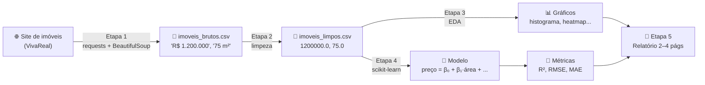

### ✅ Checklist da entrega (copie para acompanhar)

- [ ] **Etapa 1:** ≥ 100 imóveis (ideal 300+), **uma cidade só**, com `preco`, `area_m2`, `quartos`, `banheiros`, `vagas`, `bairro`, `tipo`
- [ ] **Etapa 2:** converter `"R$ 1.200.000"` → `1200000.0` e `"75 m²"` → `75.0`, tratar ausentes, remover outliers (IQR), criar `preco_m2`
- [ ] **Etapa 3:** histograma de `preco` e `preco_m2`, heatmap de correlação, scatter `area_m2 × preco` com reta, boxplot de preço pelos 10 bairros com mais anúncios
- [ ] **Etapa 4:** RLM com `area_m2, quartos, banheiros, vagas`, depois com **bairro (One-Hot)**, comparar com **Ridge/Lasso**, testar **log(preco)**, calcular **VIF**
- [ ] **Etapa 5:** relatório de 2 a 4 páginas (fonte, estatísticas, gráficos, modelo e métricas, interpretação dos coeficientes, limitações, ética)

---

## 1. Preparando o ambiente

### 1.1 Instalar as bibliotecas

Abra o terminal **na pasta do projeto** e rode:

```bash
python -m venv .venv
```

```bash
.venv\Scripts\activate
```

```bash
pip install requests beautifulsoup4 pandas numpy matplotlib seaborn scikit-learn statsmodels plotly jupyter
```

**O que é cada coisa?**

| Biblioteca | Para que serve | Analogia |
|---|---|---|
| `requests` | Baixa páginas da internet | O “navegador invisível” |
| `beautifulsoup4` (`bs4`) | Lê o HTML e acha pedaços dele | Uma lupa com filtro |
| `pandas` | Tabelas (DataFrames) | Excel dentro do Python |
| `numpy` | Contas com vetores e matrizes | Calculadora científica turbinada |
| `matplotlib` / `seaborn` | Gráficos | Papel milimetrado automático |
| `plotly` | Gráficos **interativos** (zoom, hover) | Gráfico que você pode “tocar” |
| `scikit-learn` (`sklearn`) | Modelos de Machine Learning (regressão etc.) | A caixa de ferramentas do modelo |
| `statsmodels` | Estatística clássica (VIF, testes) | O livro de estatística em código |
| `jupyter` | Notebooks (`.ipynb`) | Caderno onde código e gráfico ficam juntos |

> 💡 **O que é o `venv`?** É uma “caixinha” isolada de bibliotecas só para este projeto. Assim você não bagunça o Python do computador. O `activate` “entra” na caixinha. Se fechar o terminal, ative de novo.

### 1.2 Estrutura de pastas sugerida

```text
Avaliação1/
├── .venv/                    ← ambiente virtual (não entregue)
├── 01_coleta.ipynb           ← Etapa 1
├── 02_limpeza_eda.ipynb      ← Etapas 2 e 3
├── 03_modelagem.ipynb        ← Etapa 4
├── imoveis_brutos.csv        ← saída da Etapa 1
├── imoveis_limpos.csv        ← saída da Etapa 2
├── figs/                     ← gráficos salvos (vão para o relatório)
└── relatorio.pdf             ← Etapa 5
```

> 💡 **Notebook ou script?** Use **Jupyter Notebook** (no VS Code: *New File → Jupyter Notebook*). Você roda um pedaço (célula) por vez e vê o resultado na hora, o que é perfeito para explorar dados. Separar em 3 notebooks evita raspar o site de novo toda vez que você mexer no modelo.

---

## 2. Python de sobrevivência

Só o que você **vai usar** no projeto. Cada exemplo já fala de imóveis.

### 2.1 Variáveis e tipos

```python
preco = 750000.0          # float  → número com casa decimal
quartos = 3               # int    → número inteiro
bairro = "Savassi"        # str    → texto (string), sempre entre aspas
tem_vaga = True           # bool   → verdadeiro/falso
condominio = None         # None   → "não tem valor" (vazio)

print(type(preco))        # <class 'float'>
```

> ⚠️ `"750000"` (com aspas) é **texto**, não número. Não dá para fazer conta com ele. O site sempre te entrega **texto**; a Etapa 2 é justamente transformar texto em número.

### 2.2 Strings (textos) e seus métodos

Um **método** é uma função que “pertence” a um objeto e é chamada com ponto: `objeto.metodo()`.

```python
texto = "  R$ 1.200.000  "

texto.strip()                 # 'R$ 1.200.000'      → tira espaços das pontas
texto.replace(".", "")        # '  R$ 1200000  '    → troca um pedaço por outro
"75 m²".split(" ")            # ['75', 'm²']        → quebra em pedaços (vira lista)
"Buritis, Belo Horizonte".split(",")   # ['Buritis', ' Belo Horizonte']
"A partir de R$ 500".startswith("A partir")   # True
"apartamento".upper()         # 'APARTAMENTO'
```

**f-strings**: o jeito moderno de montar textos com variáveis dentro. Coloque `f` antes das aspas e as variáveis entre `{}`:

```python
area = 75
preco = 750000
print(f"Imóvel de {area} m² custa R$ {preco:,.2f}")
# Imóvel de 75 m² custa R$ 750,000.00
#                          └─ :,.2f = separador de milhar + 2 casas decimais
```

### 2.3 Listas: vários valores em ordem

```python
precos = [500000, 750000, 1200000]   # colchetes
precos[0]          # 500000     → o índice começa em ZERO
precos[-1]         # 1200000    → -1 é o último
len(precos)        # 3          → tamanho
precos.append(900000)   # adiciona no final
```

### 2.4 Dicionários: valores com “etiqueta”

Um dicionário é um conjunto de pares **chave → valor**. É o formato perfeito para **um imóvel**:

```python
imovel = {
    "preco": 750000,
    "area_m2": 75,
    "quartos": 3,
    "bairro": "Savassi",
}
imovel["preco"]          # 750000
imovel["vagas"] = 2      # cria uma chave nova
```

E uma **lista de dicionários** é uma tabela! Cada dicionário é uma linha:

```python
imoveis = [
    {"preco": 750000, "area_m2": 75},
    {"preco": 480000, "area_m2": 52},
]
```

> 🔑 **Isso é importantíssimo:** o scraper vai montar exatamente uma lista de dicionários, e o pandas transforma isso em tabela com `pd.DataFrame(imoveis)`.

### 2.5 `if`, `for` e indentação

Em Python, **o recuo (4 espaços) define o bloco**. Não há `{ }` como em C/Java.

```python
for imovel in imoveis:                 # "para cada imóvel na lista..."
    if imovel["area_m2"] > 60:         # ...se a área for maior que 60...
        print("Grande:", imovel["preco"])
    else:
        print("Pequeno")

for pagina in range(1, 4):             # range(1, 4) → 1, 2, 3  (o 4 NÃO entra)
    print(f"Baixando página {pagina}")
```

### 2.6 Funções

Uma função é uma “receita” reutilizável. `def` cria, `return` devolve o resultado.

```python
def calcular_preco_m2(preco, area):
    """Texto entre três aspas logo depois do def = documentação (docstring)."""
    if area == 0:
        return None
    return preco / area

calcular_preco_m2(750000, 75)   # 10000.0
```

### 2.7 List comprehension (lista em uma linha)

```python
areas = [75, 52, 120]
em_cm2 = [a * 10000 for a in areas]            # [750000, 520000, 1200000]
grandes = [a for a in areas if a > 60]         # [75, 120]
```

Lê-se: “**para cada `a` em `areas`**, me dê `a * 10000`”.

### 2.8 `import`

```python
import pandas as pd                 # importa o pacote e dá um apelido curto
from bs4 import BeautifulSoup       # importa só uma peça específica do pacote
```

### 2.9 `try/except`: não deixar o programa morrer

```python
try:
    numero = float("R$ 500")        # isso dá erro (ValueError)
except ValueError:
    numero = None                   # plano B
```

### 2.10 Expressões regulares (regex) em 2 minutos

Regex é uma “mini-linguagem” para achar padrões em textos. Você só vai precisar de três:

| Padrão | Significa | Exemplo |
|---|---|---|
| `\d` | um dígito (0–9) | `\d` acha `7` em `"75 m²"` |
| `\d+` | um ou mais dígitos seguidos | `\d+` acha `75` em `"75 m²"` |
| `[^\d]` | qualquer coisa que **não** é dígito | usado para **apagar** tudo que não é número |

```python
import re

re.sub(r"[^\d]", "", "R$ 1.200.000")      # '1200000'  → substitui não-dígitos por nada
re.search(r"\d+", "75 m²").group()        # '75'       → acha o primeiro número
re.findall(r"\d+", "2 - 3")               # ['2', '3'] → acha todos
```

> 💡 O `r` antes das aspas (`r"\d+"`) significa *raw string*: faz o Python não mexer nas barras invertidas.

---

## 3. Como a Web funciona (o mínimo para raspar dados)

### 3.1 Pedido e resposta (HTTP)

Quando você abre um site, o navegador **pede** a página ao servidor e o servidor **responde** com um texto em HTML. O `requests` faz exatamente isso, sem desenhar nada na tela.

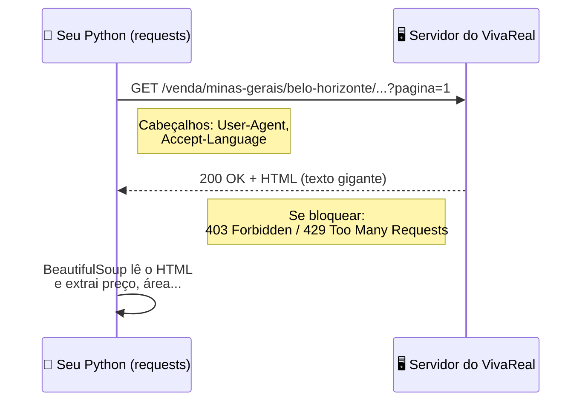

**Códigos de status que você pode ver:**

| Código | Significado | O que fazer |
|---|---|---|
| `200` | OK, veio a página | 🎉 |
| `403` | Proibido, o site achou que você é um robô | Adicione um `User-Agent`; se persistir, use outro site ou Selenium |
| `404` | Página não existe | Confira a URL |
| `429` | Pedidos demais | Aumente o `time.sleep` entre as páginas |

### 3.2 HTML é uma árvore

HTML é texto com **tags** (`<div>`, `<span>`, `<li>`...). As tags ficam umas dentro das outras, formando uma árvore. Um anúncio (simplificado) no VivaReal fica assim:

```html
<li data-cy="rp-property-cd">                                  <!-- o "card" do anúncio -->
  <div data-cy="rp-cardProperty-price-txt">
    <p><span>R$ 730.000</span></p>                            <!-- preço -->
    <p>Cond. R$ 480 • IPTU R$ 183</p>
  </div>
  <li data-cy="rp-cardProperty-propertyArea-txt">
    <span class="sr-only">Tamanho do imóvel</span> 89 m²      <!-- área -->
  </li>
  <li data-cy="rp-cardProperty-bedroomQuantity-txt">... 3</li> <!-- quartos -->
  <h2 data-cy="rp-cardProperty-location-txt">Buritis, Belo Horizonte</h2>
</li>
```

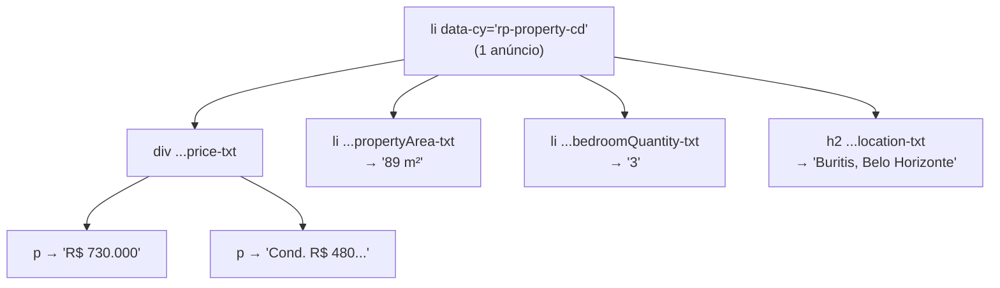

**Anatomia de uma tag:**

```text
<div  data-cy="rp-cardProperty-price-txt"  class="space-y-0-5">  R$ 730.000  </div>
 └┬┘  └──────────────┬─────────────────┘   └───────┬────────┘   └────┬────┘
 nome         atributo (nome="valor")          outro atributo        texto
```

> 💡 **O pulo do gato:** sites modernos colocam atributos como `data-cy` ou `data-testid` para os **testes automatizados deles**. Esses atributos mudam pouco, então são ótimos “ganchos” para o nosso scraper. Classes como `space-y-0-5` são de estilo e mudam o tempo todo, então evite depender delas.

### 3.3 Seletores CSS: o “endereço” de um elemento

O BeautifulSoup encontra elementos com **seletores CSS** usando `.select()` (todos) e `.select_one()` (o primeiro):

| Seletor | Encontra | Exemplo |
|---|---|---|
| `li` | todas as tags `<li>` | `soup.select("li")` |
| `.preco` | elementos com `class="preco"` | `soup.select(".preco")` |
| `#topo` | elemento com `id="topo"` | `soup.select_one("#topo")` |
| `[data-cy="x"]` | elementos com o atributo `data-cy` igual a `x` | `soup.select('[data-cy="rp-property-cd"]')` |
| `A B` | `B` que está **dentro** de `A` | `soup.select('[data-cy="rp-cardProperty-price-txt"] p')` |

### 3.4 Como descobrir os seletores sozinho (DevTools)

Isso é o que você faz quando o site muda (e ele **vai** mudar um dia):

1. Abra a página de busca no Chrome/Edge.
2. Clique com o botão direito **em cima do preço** → **Inspecionar** (ou `F12`).
3. O painel mostra o HTML com a tag do preço destacada. Procure atributos estáveis (`data-cy`, `data-testid`, `itemprop`).
4. Suba na árvore até achar a tag que **envolve o anúncio inteiro** (o “card”).
5. Teste no Python: `len(soup.select('SEU_SELETOR'))` deve dar o número de anúncios da página (no VivaReal, 30).

### 3.5 Site estático × site dinâmico

| | Estático (renderizado no servidor) | Dinâmico (renderizado com JavaScript) |
|---|---|---|
| O HTML que o `requests` baixa... | ...já contém os anúncios | ...vem quase vazio; o JavaScript preenche depois |
| Ferramenta | `requests` + `BeautifulSoup` ✅ simples e rápido | `Selenium` ou `Playwright` (abrem um navegador de verdade) |
| Teste rápido | `"R$" in resposta.text` → `True` | → `False` |

> 🔎 **Testei em 24/09/2026:** o **VivaReal** e o **ZAP** (que são do mesmo grupo e usam os mesmos atributos `data-cy`) entregaram os anúncios direto no HTML (30 por página) com `requests`, sem precisar de Selenium, apesar de o enunciado dizer o contrário (o site mudou desde que o enunciado foi escrito). O **ImovelWeb** respondeu `403` (bloqueio anti-robô). O **QuintoAndar** respondeu, mas os dados vêm num JSON dentro da página (`__NEXT_DATA__`), o que é mais trabalhoso. **Por isso este guia usa o VivaReal.**

---

## 4. Etapa 1: Web Scraping na prática

### 4.1 Ética primeiro: `robots.txt` e boas maneiras

Todo site tem um arquivo `/robots.txt` dizendo o que robôs podem ou não acessar. O do VivaReal (<https://www.vivareal.com.br/robots.txt>) tem, entre outras, estas linhas:

```text
User-agent: *
Allow: /
Disallow: *onde=*
Disallow: *tipos=*
Disallow: *quartos=*
Disallow: *precoMaximo=*
```

**Tradução:** robôs podem acessar o site, **mas não** URLs com filtros como `?onde=...`, `?tipos=...` ou `?quartos=...`. Por isso nosso scraper usa **URLs “limpas”** (`/venda/minas-gerais/belo-horizonte/apartamento_residencial/`) e só o parâmetro `?pagina=N`, que não está proibido.

**Regras de boa convivência** (e que valem pontos no item “ética” do relatório):

1. ⏱️ **Espere entre as páginas** (`time.sleep` de 2 a 4 s). Você é um visitante, não um ataque.
2. 🎯 **Colete só o necessário.** Nada de nome ou telefone de anunciante (dados pessoais → **LGPD**).
3. 🎓 **Uso acadêmico**, sem republicar a base nem usar comercialmente (os Termos de Uso dos portais proíbem).
4. 🔁 **Salve em CSV e não raspe de novo** a cada teste.

### 4.2 Passo a passo: baixar uma página

```python
import requests
from bs4 import BeautifulSoup

url = "https://www.vivareal.com.br/venda/minas-gerais/belo-horizonte/apartamento_residencial/"

headers = {
    # Diz ao servidor "sou um navegador comum". Sem isso, muitos sites bloqueiam.
    "User-Agent": ("Mozilla/5.0 (Windows NT 10.0; Win64; x64) AppleWebKit/537.36 "
                   "(KHTML, like Gecko) Chrome/124.0 Safari/537.36"),
    "Accept-Language": "pt-BR,pt;q=0.9",
}

resposta = requests.get(url, params={"pagina": 1}, headers=headers, timeout=20)
print(resposta.status_code)         # 200 = deu certo
print(resposta.url)                 # ...apartamento_residencial/?pagina=1
print(len(resposta.text))           # ~1.400.000 caracteres de HTML!
```

- `params={"pagina": 1}` → o `requests` monta o `?pagina=1` no final da URL para você.
- `timeout=20` → se o servidor não responder em 20 s, desiste (senão o programa pode travar para sempre).

### 4.3 Passo a passo: achar os anúncios

```python
sopa = BeautifulSoup(resposta.text, "html.parser")     # transforma o texto em árvore navegável

cards = sopa.select('[data-cy="rp-property-cd"]')      # lista com todos os cards
print(len(cards))                                       # 30

primeiro = cards[0]
preco = primeiro.select_one('[data-cy="rp-cardProperty-price-txt"] p')
print(preco.get_text(strip=True))                       # 'R$ 730.000'
```

`get_text(strip=True)` → pega só o texto visível, sem as tags e sem espaços sobrando.

### 4.4 O “lixo” escondido: `sr-only`

Se você pegar o texto da área direto, vem assim:

```python
primeiro.select_one('[data-cy="rp-cardProperty-propertyArea-txt"]').get_text(" ", strip=True)
# 'Tamanho do imóvel 89 m²'
```

Esse “Tamanho do imóvel” é um `<span class="sr-only">`: texto **invisível** que existe para leitores de tela (acessibilidade para pessoas cegas). Removemos com `.decompose()`, que apaga a tag da árvore:

```python
def texto(card, data_cy):
    """Devolve o texto visível do elemento com aquele data-cy, ou None se não existir."""
    elemento = card.select_one(f'[data-cy="{data_cy}"]')
    if elemento is None:                         # alguns anúncios não têm, por exemplo, vagas
        return None
    for escondido in elemento.select(".sr-only"):
        escondido.decompose()                    # remove o texto para leitor de tela
    return elemento.get_text(" ", strip=True)
```

### 4.5 O bairro

O campo de localização normalmente vem como `"Buritis, Belo Horizonte"`. Em lançamentos, ele traz o **nome do empreendimento** (ex.: `"MOMENTO"`) e o bairro vai para o campo da rua (`"Rua Alvarenga Peixoto, Santo Agostinho, Belo Horizonte"`). A função testa os dois e pega o pedaço **antes do nome da cidade**:

```python
CIDADE_NOME = "Belo Horizonte"

def extrair_bairro(card):
    local = texto(card, "rp-cardProperty-location-txt") or ""   # "or ''" troca None por texto vazio
    rua = texto(card, "rp-cardProperty-street-txt") or ""
    for candidato in (local, rua):
        partes = [p.strip() for p in candidato.split(",")]      # ['Buritis', 'Belo Horizonte']
        if len(partes) >= 2 and partes[-1] == CIDADE_NOME:
            return partes[-2]                                   # o penúltimo pedaço = bairro
    return None
```

### 4.6 O scraper completo (testado em 24/09/2026)

```python
import time
import random
import requests
import pandas as pd
from bs4 import BeautifulSoup

CIDADE_URL = "https://www.vivareal.com.br/venda/minas-gerais/belo-horizonte/"
CIDADE_NOME = "Belo Horizonte"
TIPOS = {                                  # nome que vai para a coluna "tipo" → pedaço da URL
    "apartamento": "apartamento_residencial",
    "casa": "casa_residencial",
}
PAGINAS_POR_TIPO = 6                       # 6 páginas × 30 anúncios × 2 tipos = 360 imóveis

HEADERS = {
    "User-Agent": ("Mozilla/5.0 (Windows NT 10.0; Win64; x64) AppleWebKit/537.36 "
                   "(KHTML, like Gecko) Chrome/124.0 Safari/537.36"),
    "Accept-Language": "pt-BR,pt;q=0.9",
}


def baixar_pagina(url, pagina):
    resposta = requests.get(url, params={"pagina": pagina}, headers=HEADERS, timeout=20)
    resposta.raise_for_status()            # se vier 403/404/500, levanta um erro explicativo
    return BeautifulSoup(resposta.text, "html.parser")


def texto(card, data_cy):
    elemento = card.select_one(f'[data-cy="{data_cy}"]')
    if elemento is None:
        return None
    for escondido in elemento.select(".sr-only"):
        escondido.decompose()
    return elemento.get_text(" ", strip=True)


def extrair_bairro(card):
    local = texto(card, "rp-cardProperty-location-txt") or ""
    rua = texto(card, "rp-cardProperty-street-txt") or ""
    for candidato in (local, rua):
        partes = [p.strip() for p in candidato.split(",")]
        if len(partes) >= 2 and partes[-1] == CIDADE_NOME:
            return partes[-2]
    return None


def extrair_card(card, tipo):
    bloco_preco = card.select_one('[data-cy="rp-cardProperty-price-txt"]')
    preco = bloco_preco.p.get_text(" ", strip=True) if bloco_preco else None   # só o 1º <p>
    return {                                # ← um dicionário = uma linha da tabela
        "preco": preco,
        "area_m2": texto(card, "rp-cardProperty-propertyArea-txt"),
        "quartos": texto(card, "rp-cardProperty-bedroomQuantity-txt"),
        "banheiros": texto(card, "rp-cardProperty-bathroomQuantity-txt"),
        "vagas": texto(card, "rp-cardProperty-parkingSpacesQuantity-txt"),
        "bairro": extrair_bairro(card),
        "tipo": tipo,
    }


def coletar():
    imoveis = []                                     # lista de dicionários
    for tipo, slug in TIPOS.items():                 # .items() percorre pares chave/valor
        url = CIDADE_URL + slug + "/"
        for pagina in range(1, PAGINAS_POR_TIPO + 1):
            print(f"Coletando {tipo} - página {pagina}...")
            sopa = baixar_pagina(url, pagina)
            cards = sopa.select('[data-cy="rp-property-cd"]')
            if not cards:                            # lista vazia = acabaram as páginas
                break
            for card in cards:
                imoveis.append(extrair_card(card, tipo))
            time.sleep(random.uniform(2, 4))         # pausa educada de 2 a 4 segundos
    return pd.DataFrame(imoveis)                     # lista de dicionários → tabela


bruto = coletar()
bruto.to_csv("imoveis_brutos.csv", index=False, encoding="utf-8-sig")
print(bruto.shape)        # (360, 7) → 360 linhas, 7 colunas
bruto.head(10)
```

> 💡 `encoding="utf-8-sig"` faz o Excel abrir o CSV com acentos corretos (“São Lucas” em vez de “São Lucas”).

**O que sai (dados reais da coleta de teste):**

| | preco | area_m2 | quartos | banheiros | vagas | bairro | tipo |
|---|---|---|---|---|---|---|---|
| 0 | R$ 469.570 | 80 m² | 3 | 2 | 1 | Sagrada Família | apartamento |
| 1 | **A partir de** R$ 1.480.000 | 70 m² | 2 | 2 | 2 | Lourdes | apartamento |
| 7 | R$ 592.000 | 100 m² | 3 | **2 - 3** | 2 | Ipiranga | apartamento |
| 10 | A partir de R$ ... | **75 - 1000 m²** | ... | ... | ... | ... | apartamento |
| 117 | R$ 480.000 | 150 m² | 3 | 2 | **NaN** | Graça | casa |

Repare que **tudo é texto** e há sujeira: “A partir de” (lançamentos), faixas (“2 - 3”), valores ausentes (`NaN`). Isso é normal e é o assunto da Etapa 2.

### 4.7 Se der problema

| Sintoma | Causa provável | Solução |
|---|---|---|
| `HTTPError: 403` | Bloqueio anti-robô | Confira os `HEADERS`; aumente a pausa; tente outra hora; troque de site |
| `len(cards) == 0` com status 200 | O site mudou os `data-cy` **ou** passou a ser dinâmico | Refaça a seção [3.4](#34-como-descobrir-os-seletores-sozinho-devtools); teste `"R$" in resposta.text` |
| `AttributeError: 'NoneType' object has no attribute 'p'` | Card sem aquele campo | Por isso existe o `if ... else None` |
| Muitas linhas repetidas | Anúncios “destaque” aparecem em várias páginas | `df.drop_duplicates()` na limpeza |

<details>
<summary>🧰 <b>Plano B: Selenium (só se o site virar dinâmico)</b></summary>

O Selenium abre um Chrome de verdade, espera o JavaScript carregar e aí te entrega o HTML. O resto do código (BeautifulSoup) continua igual.

```bash
pip install selenium
```

```python
from selenium import webdriver
from selenium.webdriver.common.by import By
from selenium.webdriver.support.ui import WebDriverWait
from selenium.webdriver.support import expected_conditions as EC
from bs4 import BeautifulSoup

opcoes = webdriver.ChromeOptions()
opcoes.add_argument("--headless=new")        # roda sem abrir janela
driver = webdriver.Chrome(options=opcoes)    # o Selenium 4 baixa o driver sozinho

driver.get(url + "?pagina=1")
WebDriverWait(driver, 15).until(             # espera até 15 s o 1º card aparecer
    EC.presence_of_element_located((By.CSS_SELECTOR, '[data-cy="rp-property-cd"]'))
)
sopa = BeautifulSoup(driver.page_source, "html.parser")   # daqui pra frente, igual
driver.quit()
```

> Não testei este bloco neste guia porque, hoje, o VivaReal não precisa dele.

</details>

---

## 5. Pandas: sua planilha dentro do Python

Um **DataFrame** é uma tabela: **linhas** (cada imóvel) e **colunas** (cada característica). Cada coluna sozinha é uma **Series**.

```python
import pandas as pd

df = pd.read_csv("imoveis_brutos.csv")
```

| Comando | O que faz | Equivalente no Excel |
|---|---|---|
| `df.head()` | Mostra as 5 primeiras linhas | Olhar o topo da planilha |
| `df.shape` | `(linhas, colunas)` | Contar linhas/colunas |
| `df.info()` | Tipos de cada coluna + quantos não são nulos | — |
| `df.describe()` | Média, desvio, mínimo, quartis, máximo | Várias fórmulas de uma vez |
| `df["preco"]` | Pega uma coluna (Series) | Selecionar a coluna |
| `df[["preco", "area_m2"]]` | Pega várias colunas (colchete **duplo**) | Selecionar colunas |
| `df[df["quartos"] >= 3]` | **Filtra** linhas | Filtro |
| `df["preco_m2"] = df["preco"] / df["area_m2"]` | Cria coluna calculada | Nova coluna com fórmula |
| `df["preco"].apply(func)` | Aplica uma função em cada célula | Arrastar fórmula |
| `df.isna().sum()` | Quantos vazios por coluna | `CONT.VAZIO` |
| `df.dropna()` | Remove linhas com vazios | Excluir linhas |
| `df["vagas"].fillna(0)` | Preenche vazios com 0 | Localizar e substituir |
| `df["bairro"].value_counts()` | Conta quantos de cada valor | Tabela dinâmica (contagem) |
| `df.groupby("bairro")["preco"].median()` | Mediana do preço por bairro | Tabela dinâmica (mediana) |
| `df.to_csv("x.csv", index=False)` | Salva | Salvar como CSV |

**Como funciona o filtro `df[df["quartos"] >= 3]`?**

```python
df["quartos"] >= 3
# 0     True
# 1    False
# 2     True      ← uma Series de True/False (chamada "máscara")

df[df["quartos"] >= 3]      # fica só com as linhas onde a máscara é True
```

Para combinar condições use `&` (e), `|` (ou) e **parênteses em cada condição**:

```python
df[(df["quartos"] >= 3) & (df["tipo"] == "apartamento")]
```

---

## 6. Etapa 2: Limpeza e tratamento

> “Lixo entra, lixo sai.” Um modelo treinado com dados sujos aprende coisas erradas. Esta etapa costuma ser **a mais longa** de qualquer projeto de dados de verdade.

### 6.1 Texto → número

```python
import re
import numpy as np

def limpar_preco(valor):
    """'R$ 1.200.000' → 1200000.0"""
    if pd.isna(valor):                              # pd.isna pega None e NaN
        return np.nan                               # np.nan = "Not a Number" (vazio numérico)
    so_digitos = re.sub(r"[^\d]", "", str(valor))   # 'R$ 1.200.000' → '1200000'
    return float(so_digitos) if so_digitos else np.nan


def primeiro_numero(valor):
    """'75 m²' → 75.0 | '2 - 3' → 2.0 | None → NaN"""
    if pd.isna(valor):
        return np.nan
    achado = re.search(r"\d+", str(valor).replace(".", ""))   # tira ponto de milhar antes
    return float(achado.group()) if achado else np.nan


limpar_preco("R$ 1.200.000")   # 1200000.0  ✅ tarefa obrigatória 1
primeiro_numero("75 m²")       # 75.0       ✅ tarefa obrigatória 2
primeiro_numero("2 - 3")       # 2.0
```

> 🤔 **Por que o primeiro número em “2 - 3”?** O anúncio tem **variações** (unidades com 2 ou 3 banheiros). Pegar o menor é uma escolha **conservadora**; você poderia pegar a média. O importante é **justificar no relatório**.

Aplicando na tabela:

```python
df = bruto.copy()                     # .copy() → não estraga o original

# Lançamentos têm "A partir de": não é o preço real de UMA unidade → removemos
df = df[~df["preco"].str.contains("A partir", na=False)]     # ~ inverte (NÃO contém)

df["preco"] = df["preco"].apply(limpar_preco)
for coluna in ["area_m2", "quartos", "banheiros", "vagas"]:
    df[coluna] = df[coluna].apply(primeiro_numero)

df.info()     # agora as colunas numéricas são float64 ✔
```

### 6.2 Valores ausentes (`NaN`)

Duas estratégias:

| Estratégia | Código | Quando usar |
|---|---|---|
| **Remover** (`dropna`) | `df.dropna(subset=["preco", "area_m2"])` | Quando falta algo essencial (sem preço, a linha não serve) |
| **Imputar** (preencher) | `df["vagas"].fillna(0)` | Quando o vazio tem significado óbvio ou a variável é secundária |

```python
print(df.isna().sum())            # na coleta de teste: vagas tinha 5 vazios
df["vagas"] = df["vagas"].fillna(0)      # anúncio sem vaga informada → assumimos 0
df = df.dropna(subset=["preco", "area_m2", "quartos", "banheiros", "bairro"])
df = df.drop_duplicates()                 # destaques repetidos entre páginas
```

> ⚠️ Imputar com **média** é comum, mas cuidado: “vagas = 2,6” não existe no mundo real. Para contagens, 0 ou a **mediana** fazem mais sentido.

### 6.3 Outliers e a regra do IQR

**Outlier** é um ponto muito fora do padrão: um erro de digitação (“área 5.323 m²” num apartamento), uma mansão num bairro popular, ou um terreno anunciado como casa. A regressão linear é **muito sensível** a eles: um único ponto absurdo “puxa” a reta inteira.

🎛️ *No laboratório, seção 1, clique em **“+ outlier”** e depois em **“Mostrar a melhor reta”** para ver isso acontecer.*

**Quartis:** ordene os preços. O **Q1** é o valor que deixa 25% dos imóveis abaixo dele, a **mediana (Q2)** deixa 50% e o **Q3** deixa 75%. A “caixa” do boxplot vai de Q1 a Q3.

$$
\text{IQR} = Q_3 - Q_1 \qquad
\text{limite inferior} = Q_1 - k \cdot \text{IQR} \qquad
\text{limite superior} = Q_3 + k \cdot \text{IQR}
$$

O enunciado sugere **k = 3** (só remove o que é muito absurdo). O boxplot padrão usa k = 1,5.

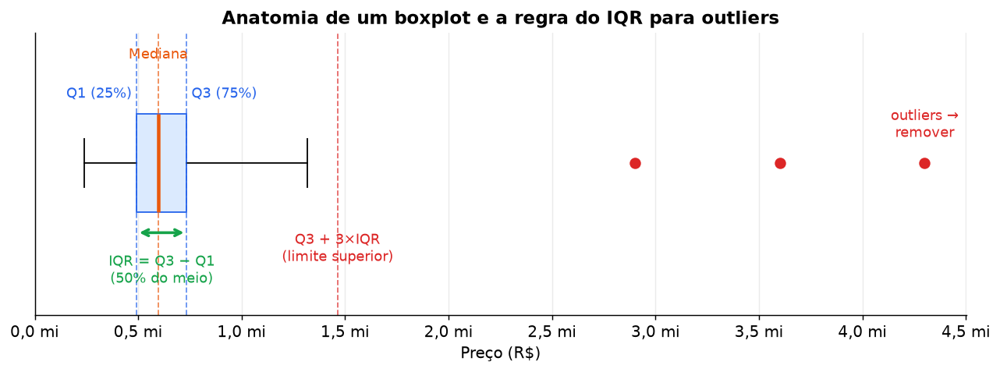

🎛️ *Laboratório, seção 3: mude o **k** e veja quantos pontos seriam removidos.*

```python
def remover_outliers_iqr(tabela, coluna, k=3):
    q1, q3 = tabela[coluna].quantile([0.25, 0.75])
    iqr = q3 - q1
    dentro = tabela[coluna].between(q1 - k * iqr, q3 + k * iqr)   # máscara True/False
    print(f"{coluna}: removendo {(~dentro).sum()} outliers")
    return tabela[dentro]


df["preco_m2"] = df["preco"] / df["area_m2"]          # ✅ tarefa obrigatória 5
for coluna in ["preco", "area_m2", "preco_m2"]:
    df = remover_outliers_iqr(df, coluna)

df.to_csv("imoveis_limpos.csv", index=False, encoding="utf-8-sig")
```

> 🧪 **História real da coleta de teste:** na primeira versão, apliquei o IQR **só no preço**. Sobrou uma “casa” com **5.323 m²** (na verdade, um terreno) e o modelo com `log(preco)` deu **R² = −2,2**, ou seja, pior do que não ter modelo nenhum. Depois de aplicar o IQR também em `area_m2` e `preco_m2`, o R² voltou para **0,43**. **Moral: olhe o `describe()` e procure mínimos e máximos absurdos.**

### 6.4 Sobre o `preco_m2`

`preco_m2` é ótimo para **análise** (comparar bairros de forma justa, achar anúncios estranhos), mas **nunca** use como variável preditora do preço. Ele é **calculado a partir do próprio preço**; seria “colar na prova” (o nome técnico é *data leakage*, vazamento de dados). O modelo teria um R² lindo e inútil, porque na vida real você não sabe o preço/m² de um imóvel sem saber o preço.

---

## 7. Etapa 3: Análise Exploratória (EDA)

EDA (*Exploratory Data Analysis*) é **conhecer os dados antes de modelar**: como os valores se distribuem, quem se relaciona com quem, se há algo estranho.

### 7.1 Estatística descritiva (relembrando)

```python
df[["preco", "area_m2", "quartos", "banheiros", "vagas", "preco_m2"]].describe().round(1)
```

Resultado real da coleta de teste (318 imóveis após a limpeza):

| | preco | area_m2 | quartos | banheiros | vagas | preco_m2 |
|---|---|---|---|---|---|---|
| **count** | 318 | 318 | 318 | 318 | 318 | 318 |
| **mean** (média) | 823.155 | 186,1 | 3,1 | 2,5 | 2,6 | 5.728,6 |
| **std** (desvio padrão) | 373.759 | 115,5 | 0,9 | 0,9 | 1,6 | 3.173,9 |
| **min** | 159.720 | 43,0 | 2 | 1 | 0 | 806,5 |
| **25%** (Q1) | 517.000 | 87,2 | 2 | 2 | 2 | 3.373,7 |
| **50%** (mediana) | 720.000 | 153,0 | 3 | 2 | 2 | 5.019,5 |
| **75%** (Q3) | 990.000 | 250,0 | 4 | 3 | 3 | 7.631,7 |
| **max** | 2.500.000 | 620,0 | 8 | 6 | 12 | 19.242,4 |

**Como ler:**
- **Média × mediana:** a média do preço (823 mil) é **maior** que a mediana (720 mil). Isso indica uma **cauda à direita**: poucos imóveis caríssimos puxam a média para cima. Para preço, a **mediana** representa melhor o “imóvel típico”.
- **Desvio padrão (std):** o “tamanho típico” da distância de um imóvel até a média. Um std de R$ 374 mil é grande, ou seja, os preços variam muito.

$$
\bar{x} = \frac{1}{n}\sum_{i=1}^{n} x_i
\qquad\qquad
s = \sqrt{\frac{1}{n-1}\sum_{i=1}^{n}(x_i - \bar{x})^2}
$$

### 7.2 Histogramas

Um histograma divide os valores em “faixas” (*bins*) e conta quantos imóveis caem em cada uma.

```python
import matplotlib.pyplot as plt
import seaborn as sns

fig, axes = plt.subplots(1, 2, figsize=(12, 4))      # 1 linha, 2 gráficos lado a lado
sns.histplot(df["preco"], bins=30, kde=True, ax=axes[0])
axes[0].set_title("Distribuição de preço")
sns.histplot(df["preco_m2"], bins=30, kde=True, ax=axes[1], color="green")
axes[1].set_title("Distribuição de preço por m²")
plt.tight_layout()
plt.savefig("figs/histogramas.png", dpi=150)          # salva para o relatório
plt.show()
```

- `kde=True` desenha uma curva suave por cima (estimativa da densidade).
- `ax=axes[0]` diz em qual dos gráficos desenhar.

Preços de imóveis quase sempre têm este formato de **cauda longa**. Tirar o **logaritmo** deixa a distribuição mais simétrica, o que ajuda a regressão (voltamos nisso na [seção 10.5](#105-transformação-logarítmica)):

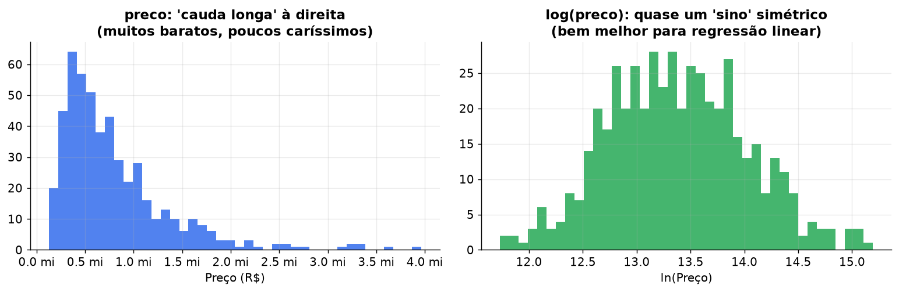

### 7.3 Correlação e heatmap

O **coeficiente de correlação de Pearson (r)** mede o quanto duas variáveis andam juntas **em linha reta**. Vai de −1 a +1:

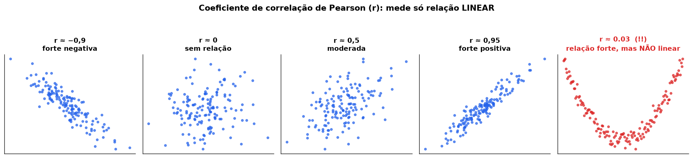

$$
r = \frac{\sum (x_i - \bar{x})(y_i - \bar{y})}{\sqrt{\sum (x_i - \bar{x})^2}\ \sqrt{\sum (y_i - \bar{y})^2}}
$$

> ⚠️ **Veja o último gráfico:** relação fortíssima (uma parábola) e mesmo assim **r ≈ 0**. Pearson só enxerga **linha reta**. É por isso que o enunciado pergunta “a relação é linear?”: **olhe sempre o scatter**, não só o número.

🎛️ *Laboratório, seção 2: arraste o r e marque “relação em curva”.*

```python
numericas = ["preco", "area_m2", "quartos", "banheiros", "vagas", "preco_m2"]
plt.figure(figsize=(7, 6))
sns.heatmap(df[numericas].corr(), annot=True, fmt=".2f", cmap="coolwarm", vmin=-1, vmax=1)
plt.title("Matriz de correlação")
plt.tight_layout()
plt.savefig("figs/correlacao.png", dpi=150)
plt.show()
```

- `annot=True` escreve o número dentro de cada quadrado; `fmt=".2f"` usa 2 casas.
- `vmin=-1, vmax=1` fixa a escala de cores (vermelho = positivo, azul = negativo).

Correlação com o preço na coleta de teste:

```python
df[numericas].corr()["preco"].sort_values(ascending=False)
```

```text
banheiros    0.48
quartos      0.46
area_m2      0.35   ← surpreendentemente baixa! (veja a 9.3)
vagas        0.30
```

### 7.4 Scatter com reta de tendência

```python
plt.figure(figsize=(8, 5))
sns.regplot(data=df, x="area_m2", y="preco",
            scatter_kws={"alpha": 0.5},          # pontos semitransparentes
            line_kws={"color": "red"})           # a reta de regressão (RLS!) em vermelho
plt.title("Área × Preço com reta de tendência")
plt.savefig("figs/scatter_area_preco.png", dpi=150)
plt.show()
```

O `regplot` já calcula e desenha uma **Regressão Linear Simples**. A faixa sombreada em volta da reta é o **intervalo de confiança** (onde a reta “verdadeira” provavelmente está).

**Versão interativa com Plotly** (passe o mouse nos pontos para ver bairro e preço):

```python
import plotly.express as px

fig = px.scatter(df, x="area_m2", y="preco", color="tipo",
                 hover_data=["bairro", "quartos", "vagas"],
                 trendline="ols",                 # ols = mínimos quadrados = RLS
                 title="Área × Preço (passe o mouse nos pontos)")
fig.show()
fig.write_html("figs/scatter_interativo.html")    # abre no navegador depois
```

### 7.5 Boxplot por bairro (top 10)

```python
top10 = df["bairro"].value_counts().head(10).index       # os 10 bairros com mais anúncios

plt.figure(figsize=(9, 6))
sns.boxplot(data=df[df["bairro"].isin(top10)],            # .isin → "está na lista?"
            x="preco", y="bairro", order=top10)
plt.title("Preço por bairro (10 bairros com mais anúncios)")
plt.tight_layout()
plt.savefig("figs/boxplot_bairros.png", dpi=150)
plt.show()
```

**Leitura:** caixas mais à direita = bairros mais caros; caixas largas = bairros com preços muito variados.

### 7.6 Respondendo à “pergunta para reflexão”

> *Quais variáveis parecem mais correlacionadas com o preço? A relação é linear?*

Um bom roteiro de resposta:
1. Cite o **ranking** das correlações do heatmap (na coleta de teste: banheiros 0,48 > quartos 0,46 > área 0,35 > vagas 0,30).
2. Olhe o **scatter**: os pontos seguem uma reta ou uma curva? Há “funil” (a dispersão aumenta com o tamanho)? Há **grupos separados** (casas × apartamentos)?
3. Compare `preco` com `log(preco)`: se o log deixar a relação mais “reta”, isso justifica a transformação da Etapa 4.

---

## 8. A teoria: Regressão Linear Simples (RLS)

### 8.1 A ideia

Você tem uma nuvem de pontos (área × preço) e quer **uma reta que resuma a tendência**, para poder dizer: *“um imóvel de 120 m² deve custar uns R$ X”*.

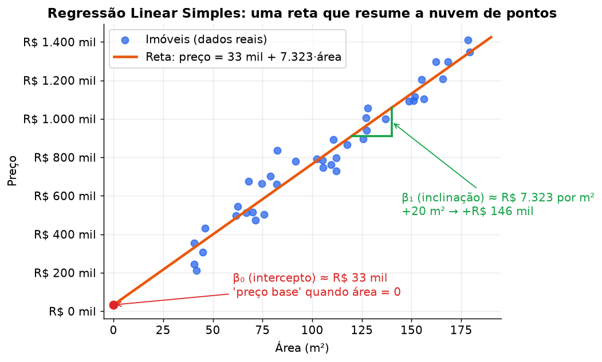

A equação é a mesma reta do ensino médio (`y = ax + b`), só com outros nomes:

$$
\hat{y} = \beta_0 + \beta_1 \cdot x
$$

| Símbolo | Nome | No nosso problema |
|---|---|---|
| $x$ | variável **explicativa** (preditora, *feature*) | área em m² |
| $y$ | variável **resposta** (alvo, *target*) | preço real |
| $\hat{y}$ (“y-chapéu”) | **previsão** do modelo | preço estimado |
| $\beta_0$ | **intercepto** | preço quando $x = 0$ (muitas vezes sem sentido físico, só “ajusta a altura” da reta) |
| $\beta_1$ | **coeficiente angular** (inclinação) | **quanto o preço sobe para cada 1 m² a mais** |

### 8.2 Resíduo: o erro de cada ponto

Nenhuma reta passa por todos os pontos. A diferença entre o **real** e o **previsto** é o **resíduo**:

$$
e_i = y_i - \hat{y}_i
$$

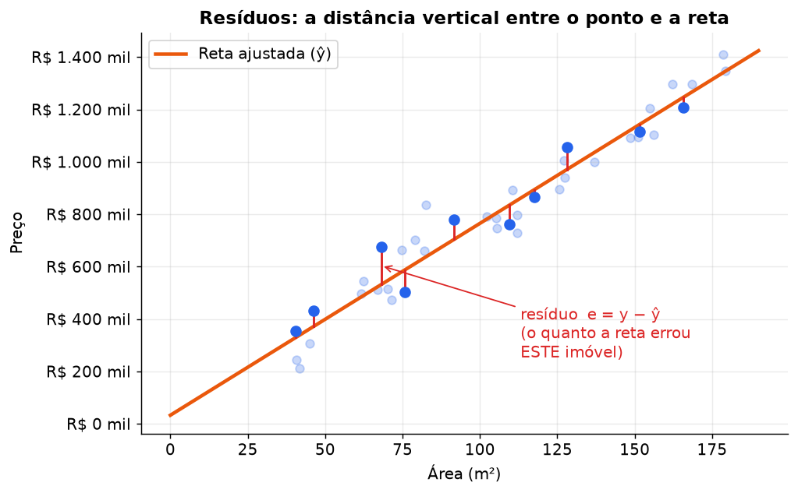

- $e_i > 0$ → o imóvel é **mais caro** do que a reta prevê (talvez tenha vista, piscina, bairro nobre...).
- $e_i < 0$ → é **mais barato** do que o previsto (oportunidade? problema escondido?).

### 8.3 Qual é a “melhor” reta? Mínimos Quadrados (MQO / OLS)

Existem infinitas retas. A regra escolhida pela estatística é: **a melhor reta é a que tem a menor soma dos quadrados dos resíduos** (SSE, *Sum of Squared Errors*):

$$
\text{SSE} = \sum_{i=1}^{n} e_i^2 = \sum_{i=1}^{n} \left(y_i - (\beta_0 + \beta_1 x_i)\right)^2
$$

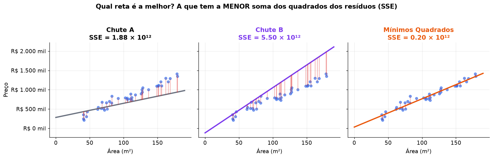

**Por que elevar ao quadrado?**
1. Para os erros positivos e negativos **não se cancelarem** (senão uma reta horrível poderia ter soma zero).
2. Para **punir mais os erros grandes** (errar 200 mil “custa” 4× mais que errar 100 mil).
3. Porque a função fica uma **parábola** (uma “tigela”), e o fundo da tigela se acha com **derivada = 0**, algo que você viu em Cálculo 1:

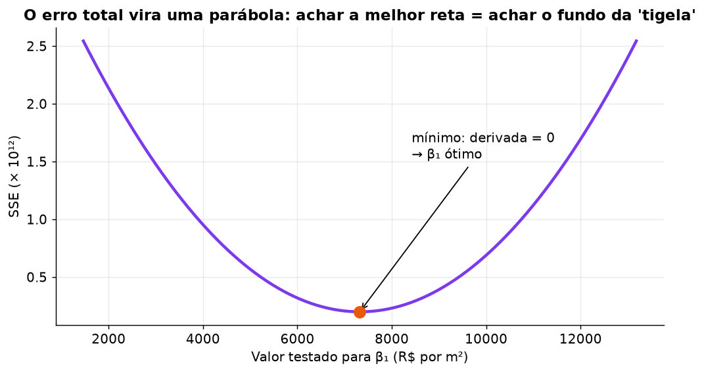

🎛️ *Laboratório, seção 1: **seja você o algoritmo.** Mexa em β₀ e β₁ tentando deixar o SSE mínimo. Marque “mostrar os quadrados”: você está literalmente minimizando a área total dos quadrados vermelhos.*

### 8.4 As fórmulas (resultado de derivar o SSE e igualar a zero)

$$
\beta_1 = \frac{\sum (x_i - \bar{x})(y_i - \bar{y})}{\sum (x_i - \bar{x})^2}
\qquad\qquad
\beta_0 = \bar{y} - \beta_1 \bar{x}
$$

<details>
<summary>📐 <b>De onde saem essas fórmulas? (para quem quer ver a derivação)</b></summary>

Queremos minimizar $S(\beta_0, \beta_1) = \sum (y_i - \beta_0 - \beta_1 x_i)^2$. No mínimo, as derivadas parciais são zero:

$$
\frac{\partial S}{\partial \beta_0} = -2\sum (y_i - \beta_0 - \beta_1 x_i) = 0
\;\Rightarrow\; \beta_0 = \bar{y} - \beta_1 \bar{x}
$$

$$
\frac{\partial S}{\partial \beta_1} = -2\sum x_i (y_i - \beta_0 - \beta_1 x_i) = 0
$$

Substituindo $\beta_0$ na segunda equação e reorganizando, chega-se a $\beta_1 = \dfrac{\sum (x_i-\bar{x})(y_i-\bar{y})}{\sum (x_i-\bar{x})^2}$.

</details>

### 8.5 Exemplo feito à mão (5 imóveis)

| Imóvel | área $x$ (m²) | preço $y$ (R$ mil) | $x - \bar{x}$ | $y - \bar{y}$ | $(x-\bar{x})(y-\bar{y})$ | $(x-\bar{x})^2$ |
|---|---|---|---|---|---|---|
| A | 50 | 300 | −40 | −210 | 8.400 | 1.600 |
| B | 70 | 420 | −20 | −90 | 1.800 | 400 |
| C | 80 | 450 | −10 | −60 | 600 | 100 |
| D | 100 | 560 | 10 | 50 | 500 | 100 |
| E | 150 | 820 | 60 | 310 | 18.600 | 3.600 |
| **Média / Soma** | $\bar{x}=90$ | $\bar{y}=510$ | | | **29.900** | **5.800** |

$$
\beta_1 = \frac{29900}{5800} \approx 5{,}155
\qquad\qquad
\beta_0 = 510 - 5{,}155 \times 90 \approx 46{,}0
$$

Ou seja: **β₁ ≈ 5,155 mil por m²** (cada m² a mais soma ≈ R$ 5.155 ao preço) e **β₀ ≈ R$ 46 mil**.

**Modelo:** $\widehat{\text{preço}} = 46{,}0 + 5{,}155 \cdot \text{área}$ (em R$ mil).

**Previsão para um imóvel de 120 m²:** $46{,}0 + 5{,}155 \times 120 \approx$ **R$ 664,7 mil**.

**Conferindo no Python** (sempre bom verificar a conta à mão):

```python
import numpy as np
from sklearn.linear_model import LinearRegression

area = np.array([50, 70, 80, 100, 150])
preco = np.array([300, 420, 450, 560, 820])

# 1) Pelas fórmulas, com numpy
b1 = np.sum((area - area.mean()) * (preco - preco.mean())) / np.sum((area - area.mean()) ** 2)
b0 = preco.mean() - b1 * area.mean()
print(b0, b1)                                # 46.03  5.155

# 2) Com scikit-learn
modelo = LinearRegression()
modelo.fit(area.reshape(-1, 1), preco)       # sklearn exige X em formato de TABELA (2D)
print(modelo.intercept_, modelo.coef_)       # 46.03  [5.155]
print(modelo.predict([[120]]))               # [664.66]
```

> 💡 **O que é `reshape(-1, 1)`?** O sklearn espera `X` como uma **tabela** (linhas × colunas), mesmo com uma coluna só. `reshape(-1, 1)` transforma `[50, 70, 80]` em `[[50], [70], [80]]`: “quantas linhas precisar (−1), 1 coluna”. Com DataFrame isso não é preciso: `df[["area_m2"]]` (colchete duplo) já é uma tabela.

---

## 9. A teoria: Regressão Linear Múltipla (RLM)

### 9.1 Mais de uma variável

O preço não depende só da área. A RLM usa **todas ao mesmo tempo**:

$$
\widehat{\text{preço}} = \beta_0 + \beta_1\cdot\text{área} + \beta_2\cdot\text{quartos} + \beta_3\cdot\text{banheiros} + \beta_4\cdot\text{vagas}
$$

Com 2 variáveis, a reta vira um **plano** no espaço 3D. Com 4 ou mais, é um “hiperplano” (impossível de desenhar, mas a matemática é a mesma).

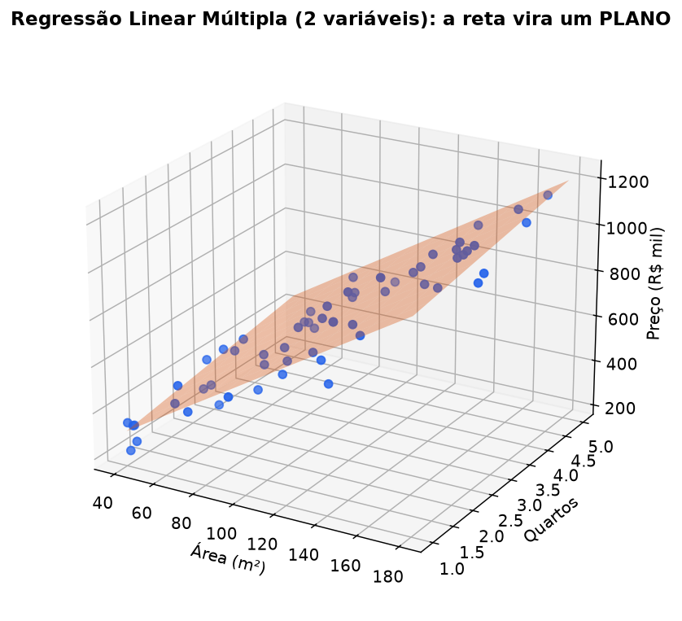

**Forma matricial** (é assim que o computador resolve, usando Álgebra Linear):

$$
\mathbf{y} = \mathbf{X}\boldsymbol{\beta} + \boldsymbol{\varepsilon}
\qquad\Longrightarrow\qquad
\hat{\boldsymbol{\beta}} = (\mathbf{X}^\top\mathbf{X})^{-1}\mathbf{X}^\top\mathbf{y}
$$

- $\mathbf{X}$: a tabela de características (uma linha por imóvel, uma coluna por variável, mais uma coluna de 1s para o intercepto).
- $\hat{\boldsymbol{\beta}}$: o vetor com todos os coeficientes.
- A ideia é **exatamente** a mesma da RLS: minimizar a soma dos quadrados dos resíduos.

```python
# A fórmula matricial "na mão" com numpy (só para ver que funciona):
X = np.column_stack([np.ones(len(df)), df[["area_m2", "quartos", "banheiros", "vagas"]]])
beta = np.linalg.inv(X.T @ X) @ X.T @ df["preco"]      # @ = multiplicação de matrizes
print(beta)            # [β0, β_area, β_quartos, β_banheiros, β_vagas]
```

### 9.2 A diferença-chave: “mantendo o resto constante”

Na RLM, cada coeficiente mede o efeito **daquela** variável **com todas as outras fixas** (*ceteris paribus*).

> Se $\beta_{\text{vagas}} = 23.000$: *“comparando dois imóveis **iguais em área, quartos e banheiros**, o que tem uma vaga a mais custa, em média, R$ 23 mil a mais.”*

🎛️ *Laboratório, seção 5: a calculadora mostra cada variável somando seu “pedaço” no preço final.*

### 9.3 Por que misturar grupos engana (e por que `tipo` e `bairro` importam)

Na coleta de teste, a correlação área × preço foi de só **0,35** no geral, mas **0,58** olhando só apartamentos. Por quê? Veja as medianas reais:

| tipo | preço mediano | área mediana | preço/m² mediano |
|---|---|---|---|
| apartamento | R$ 725 mil | 87 m² | **R$ 7.734** |
| casa | R$ 720 mil | 240 m² | **R$ 3.668** |

Casas são **maiores** e **mais baratas por m²**. Misturar tudo numa reta só distorce a inclinação:

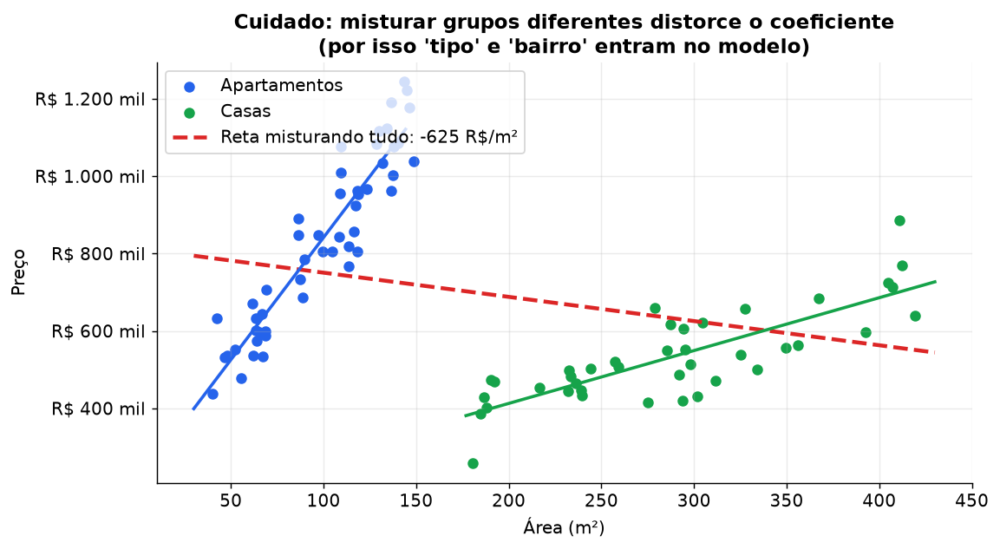

No modelo real: o coeficiente da área era **R$ 564/m²** sem a variável `tipo` e subiu para **R$ 1.315/m²** quando `tipo` e `bairro` entraram. **Esquecer uma variável importante contamina os coeficientes das outras** (nome técnico: *viés de variável omitida*).

### 9.4 Pressupostos da regressão linear (o “LINE”)

| Letra | Pressuposto | Em português | Como checar |
|---|---|---|---|
| **L** | *Linearity* | A relação é aproximadamente uma reta | Scatter; gráfico de resíduos sem curva |
| **I** | *Independence* | Um anúncio não influencia o outro | Remover duplicados |
| **N** | *Normality* | Resíduos têm forma de sino | Histograma dos resíduos |
| **E** | *Equal variance* | O erro tem tamanho parecido para imóveis baratos e caros | Gráfico de resíduos sem “funil” |

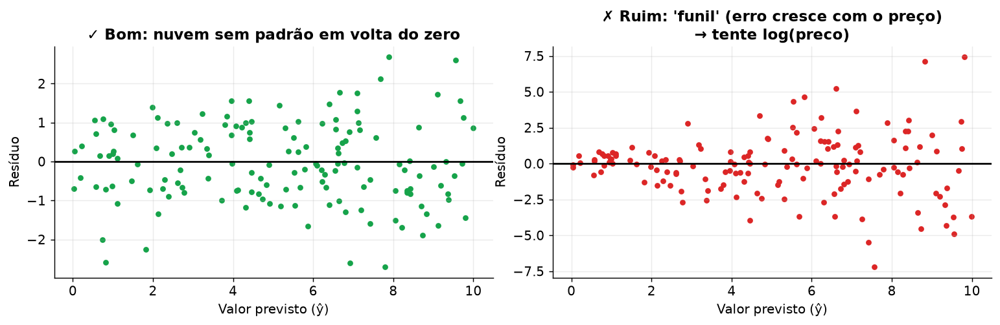

Preço de imóvel quase sempre dá **funil** (errar 10% de um imóvel de 3 milhões é muito mais dinheiro que errar 10% de um de 300 mil). O remédio clássico é o **log(preço)**.

---

## 10. Etapa 4: Modelagem com scikit-learn

### 10.1 Treino e teste: a “prova surpresa” do modelo

Se você avaliar o modelo com os **mesmos** dados que ele usou para aprender, é como fazer a prova com o gabarito na mão. Por isso separamos:

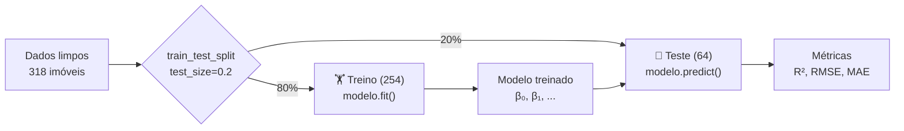

```python
from sklearn.model_selection import train_test_split
from sklearn.linear_model import LinearRegression

features = ["area_m2", "quartos", "banheiros", "vagas"]
X = df[features]          # tabela de entrada (maiúsculo por convenção: é uma matriz)
y = df["preco"]           # vetor de saída (minúsculo: é um vetor)

X_train, X_test, y_train, y_test = train_test_split(
    X, y,
    test_size=0.2,        # 20% para teste
    random_state=42,      # "semente": o sorteio sai sempre igual (reprodutível)
)

modelo = LinearRegression()
modelo.fit(X_train, y_train)          # ← aqui acontecem os Mínimos Quadrados
y_pred = modelo.predict(X_test)       # previsões para imóveis que o modelo NUNCA viu
```

O padrão do scikit-learn é sempre o mesmo, para qualquer modelo:

```text
modelo = Classe(parâmetros)   →   modelo.fit(X_treino, y_treino)   →   modelo.predict(X_novo)
```

### 10.2 Métricas: R², RMSE e MAE

$$
R^2 = 1 - \frac{\sum (y_i - \hat{y}_i)^2}{\sum (y_i - \bar{y})^2}
\qquad
\text{RMSE} = \sqrt{\frac{1}{n}\sum (y_i - \hat{y}_i)^2}
\qquad
\text{MAE} = \frac{1}{n}\sum |y_i - \hat{y}_i|
$$

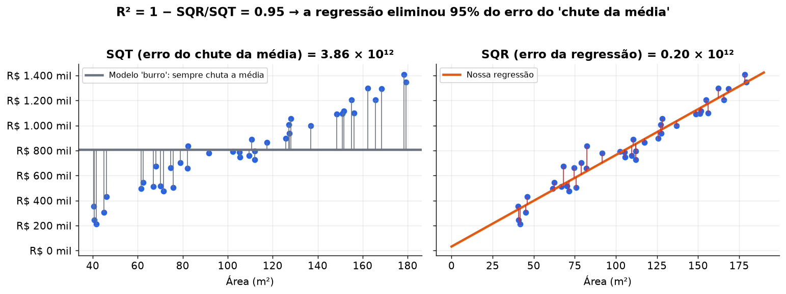

| Métrica | Pergunta que responde | Unidade | Bom quando |
|---|---|---|---|
| **R²** | “Que fração da variação dos preços o modelo explica, comparado a chutar sempre a média?” | nenhuma (0 a 1) | perto de 1. **Pode ser negativo** se o modelo for pior que a média! |
| **RMSE** | “Quanto, tipicamente, o modelo erra?” (pune mais os erros grandes) | R$ | pequeno |
| **MAE** | “Em média, quantos reais o modelo erra?” (mais fácil de explicar) | R$ | pequeno |

```python
import numpy as np
from sklearn.metrics import r2_score, mean_squared_error, mean_absolute_error

def avaliar(nome, y_real, y_previsto):
    r2 = r2_score(y_real, y_previsto)
    rmse = np.sqrt(mean_squared_error(y_real, y_previsto))
    mae = mean_absolute_error(y_real, y_previsto)
    print(f"{nome:<28} R²={r2:6.3f}   RMSE=R$ {rmse:>11,.0f}   MAE=R$ {mae:>11,.0f}")
    return {"modelo": nome, "R2": r2, "RMSE": rmse, "MAE": mae}

avaliar("RLM numéricas", y_test, y_pred)
```

> 💡 `{nome:<28}` alinha o texto à esquerda em 28 caracteres; `{rmse:>11,.0f}` alinha à direita, com separador de milhar e 0 casas. Só estética para a tabela ficar bonita no terminal.

**Coeficientes:**

```python
pd.Series(modelo.coef_, index=features)     # um coeficiente por variável
modelo.intercept_                            # o β0
```

### 10.3 One-Hot Encoding: colocando o bairro no modelo

Regressão só entende **números**. Não dá para multiplicar “Savassi” por um coeficiente. A solução é criar uma coluna 0/1 para cada bairro (*variáveis dummy*):

**Antes:**

| bairro |
|---|
| Buritis |
| Serra |
| Havaí |
| Buritis |

**Depois de `pd.get_dummies(..., drop_first=True)`:**

| bairro_Havaí | bairro_Serra |
|---|---|
| 0 | 0 |
| 0 | 1 |
| 1 | 0 |
| 0 | 0 |

Repare que **Buritis sumiu**: ele virou a **categoria de referência** (é o caso em que todas as colunas valem 0). Isso é o `drop_first=True`, e é **obrigatório** na regressão linear: se todas as colunas existissem, elas sempre somariam 1 e ficariam “repetindo” o intercepto (a *armadilha das dummies*, uma multicolinearidade perfeita).

**Interpretação:** o coeficiente de `bairro_Serra` = *“quanto um imóvel na Serra custa a mais (ou a menos) do que um imóvel **igual** no bairro de referência”*.

```python
# Bairros com pouquíssimos anúncios viram "Outros" (1 anúncio não ensina nada ao modelo)
contagem = df["bairro"].value_counts()
df["bairro_grp"] = df["bairro"].where(df["bairro"].map(contagem) >= 3, "Outros")
#                   └ mantém o bairro ONDE a condição é True; senão coloca "Outros"

X2 = pd.get_dummies(df[features + ["bairro_grp", "tipo"]],
                    columns=["bairro_grp", "tipo"], drop_first=True, dtype=int)
print(X2.shape)       # muitas colunas novas!

X2_train, X2_test, y_train, y_test = train_test_split(X2, y, test_size=0.2, random_state=42)
rlm2 = LinearRegression().fit(X2_train, y_train)
avaliar("RLM + bairro + tipo", y_test, rlm2.predict(X2_test))
```

> ⚠️ Use o **mesmo** `random_state` em todos os `train_test_split`. Assim, todos os modelos são testados nos **mesmos imóveis** e a comparação é justa.

### 10.4 Ridge e Lasso: regressão com “freio”

Com muitas colunas (dezenas de bairros) e poucos dados, a RLM comum tende a **decorar** o treino (*overfitting*): coeficientes enormes e instáveis que funcionam no treino e falham no teste. Ridge e Lasso adicionam uma **penalidade** ao SSE que “freia” os coeficientes:

$$
\text{Ridge (L2):}\quad \min\ \text{SSE} + \alpha\sum_j \beta_j^2
\qquad\qquad
\text{Lasso (L1):}\quad \min\ \text{SSE} + \alpha\sum_j |\beta_j|
$$

- $\alpha$ (alfa) = força do freio. $\alpha = 0$ → vira a regressão comum. $\alpha$ enorme → todos os coeficientes vão a zero.
- **Ridge** encolhe todos os coeficientes, mas nenhum chega a zero exato.
- **Lasso** consegue **zerar** coeficientes, ou seja, faz **seleção de variáveis** automaticamente.

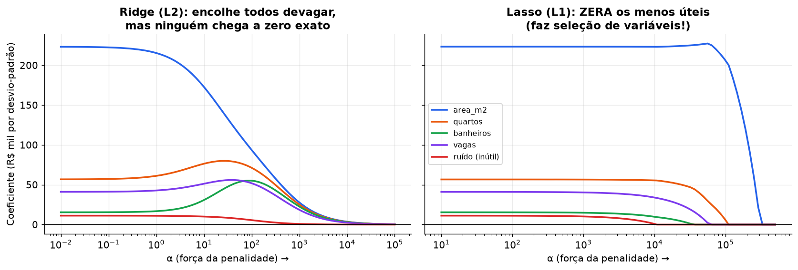

🎛️ *Laboratório, seção 4: arraste a penalidade e veja o Lasso zerar o “ruído” primeiro.*

**Dois cuidados obrigatórios:**
1. **Padronizar** (`StandardScaler`): transforma cada variável para média 0 e desvio 1. Sem isso, a penalidade é injusta: área (dezenas a centenas) e quartos (1 a 5) estão em escalas diferentes.
2. **Escolher o α** por **validação cruzada** (`RidgeCV`, `LassoCV`): o sklearn testa vários α e fica com o melhor.

```python
from sklearn.linear_model import RidgeCV, LassoCV
from sklearn.preprocessing import StandardScaler
from sklearn.pipeline import make_pipeline

alphas = np.logspace(-2, 4, 50)       # 50 valores de 0,01 a 10.000 em escala log

ridge = make_pipeline(StandardScaler(), RidgeCV(alphas=alphas)).fit(X2_train, y_train)
avaliar("Ridge", y_test, ridge.predict(X2_test))

lasso = make_pipeline(StandardScaler(), LassoCV(cv=5, max_iter=50_000, random_state=42))
lasso.fit(X2_train, y_train)
avaliar("Lasso", y_test, lasso.predict(X2_test))

print("alpha Ridge:", ridge[-1].alpha_)                  # ridge[-1] = último passo do pipeline
print("Lasso zerou", (lasso[-1].coef_ == 0).sum(), "coeficientes")
```

> 💡 **Pipeline** = “esteira”: os dados passam pelo `StandardScaler` e depois pelo modelo. A vantagem é que o scaler **aprende média e desvio só no treino**, evitando vazamento de informação do teste.
>
> 💡 **Validação cruzada (cv=5)**: divide o treino em 5 pedaços, treina em 4 e testa no 5º, cinco vezes, fazendo um rodízio. A média dessas 5 notas é uma estimativa mais confiável do que um único sorteio.

### 10.5 Transformação logarítmica

Treinamos o modelo para prever $\ln(\text{preço})$ em vez do preço:

$$
\ln(\widehat{\text{preço}}) = \beta_0 + \beta_1\cdot\text{área} + \dots
$$

```python
rlm_log = LinearRegression().fit(X2_train, np.log(y_train))     # treina no log
previsto = np.exp(rlm_log.predict(X2_test))                       # volta para reais com exp
avaliar("RLM + log(preco)", y_test, previsto)
```

> ⚠️ **Sempre** volte com `np.exp()` antes de calcular RMSE e MAE; senão você compara reais com logaritmos.

**Vantagens:** corrige a cauda longa e o “funil” dos resíduos, e os coeficientes viram **porcentagens**:

$$
\text{efeito de +1 unidade} = (e^{\beta} - 1)\times 100\%
$$

```python
coefs_log = pd.Series(rlm_log.coef_, index=X2.columns)
(100 * (np.exp(coefs_log[features]) - 1)).round(1)
# banheiros    12.1   → cada banheiro a mais: +12,1% no preço (mantendo o resto igual)
# quartos       7.3
# vagas         3.4
# area_m2       0.2   → cada m² a mais: +0,2%  (≈ +2% a cada 10 m²)
```

### 10.6 Multicolinearidade e VIF

**Multicolinearidade** = variáveis preditoras muito correlacionadas **entre si** (ex.: área e quartos: imóvel grande costuma ter mais quartos). O modelo fica “confuso” sobre a quem dar o crédito: os coeficientes ficam instáveis e podem até trocar de sinal, embora as **previsões** continuem boas.

O **VIF** (*Variance Inflation Factor*) mede isso para cada variável $j$: faz uma regressão de $x_j$ contra **todas as outras** preditoras e vê o $R^2_j$:

$$
\text{VIF}_j = \frac{1}{1 - R^2_j}
$$

| VIF | Leitura |
|---|---|
| 1 | Nenhuma correlação com as outras 😎 |
| 1 a 5 | Aceitável |
| 5 a 10 | Preocupante |
| > 10 | Grave: considere remover ou juntar variáveis (ou usar Ridge) |

```python
from statsmodels.stats.outliers_influence import variance_inflation_factor
from statsmodels.tools.tools import add_constant

Xv = add_constant(df[features])           # o VIF precisa da coluna de 1s (intercepto)
vif = pd.DataFrame({
    "variavel": Xv.columns,
    "VIF": [variance_inflation_factor(Xv.values, i) for i in range(Xv.shape[1])],
})
print(vif[vif["variavel"] != "const"].round(2))     # ignore a linha "const"
```

Resultado real: área 1,39 · quartos 1,47 · banheiros 1,33 · vagas 1,22 → **sem multicolinearidade relevante**.

### 10.7 Comparando tudo (resultados reais da coleta de teste)

```python
resultados = [...]      # junte os dicionários devolvidos por avaliar()
pd.DataFrame(resultados).round(3)
```

| Modelo | R² | RMSE | MAE |
|---|---|---|---|
| RLM numéricas (área, quartos, banheiros, vagas) | 0,283 | R$ 309.038 | R$ 241.820 |
| RLM + bairro + tipo (One-Hot) | 0,402 | R$ 282.348 | R$ 224.867 |
| **Ridge** (α ≈ 110) | **0,442** | **R$ 272.547** | R$ 214.483 |
| Lasso (zerou 16 de 46 coeficientes) | 0,436 | R$ 274.111 | R$ 219.188 |
| RLM + log(preco) | 0,430 | R$ 275.488 | **R$ 204.846** |

**Como contar essa história no relatório:**
1. Só com as 4 variáveis numéricas, o modelo explica **28%** da variação dos preços.
2. Colocar **bairro e tipo** sobe para **40%**: localização importa muito, como qualquer corretor diria.
3. Com dezenas de colunas de bairro e ~250 imóveis de treino, a RLM comum começa a “decorar”; **Ridge e Lasso** regularizam e chegam a **~44%**.
4. O **log** dá o **menor MAE** (erra menos em reais “no típico”).
5. Um R² de 0,4 a 0,5 é **esperado** para anúncios: falta informação que o preço “enxerga” e o modelo não (andar, estado de conservação, lazer, vista, idade do prédio). Com 300+ imóveis e dados mais ricos, o número melhora.

> 🎯 **Seus números vão ser diferentes** (outra data, outra cidade, outros anúncios). O que importa é **comparar os modelos entre si e explicar o porquê**.

### 10.8 Gráfico de resíduos (vale colocar no relatório)

```python
previsto = rlm2.predict(X2_test)
plt.figure(figsize=(7, 4))
plt.scatter(previsto, y_test - previsto, alpha=0.6)
plt.axhline(0, color="red")                    # linha do "erro zero"
plt.xlabel("Preço previsto"); plt.ylabel("Resíduo (real − previsto)")
plt.title("Resíduos do modelo")
plt.savefig("figs/residuos.png", dpi=150)
plt.show()
```

Se aparecer um **funil** (resíduos espalhando mais à direita), cite isso como justificativa para o `log(preco)`.

---

## 11. Etapa 5: O relatório

**Tamanho:** 2 a 4 páginas. **Sugestão de estrutura** (seguindo exatamente os 7 itens do enunciado):

```text
1. Introdução e fonte de dados                              (~½ página)
   - Site, cidade, data da coleta, quantidade de anúncios
   - Método: requests + BeautifulSoup, seletores data-cy, paginação ?pagina=N,
     pausa de 2–4 s, tipos coletados (apartamento/casa)

2. Tratamento dos dados                                     (~½ página)
   - Conversões (R$ → float, m² → float), faixas "2 - 3", "A partir de"
   - Ausentes: quantos, o que foi feito
   - Outliers: IQR com k = 3 em preco, area_m2, preco_m2 → quantos removidos
   - Tabela de estatísticas descritivas (describe)

3. Análise exploratória                                     (~1 página)
   - Histogramas, heatmap, scatter, boxplot por bairro
   - Resposta: quais variáveis correlacionam mais? É linear?

4. Modelagem                                                (~1 página)
   - Equação do modelo, divisão 80/20, random_state
   - Tabela comparativa (RLM, +bairro, Ridge, Lasso, log) com R², RMSE, MAE
   - VIF
   - Interpretação dos coeficientes

5. Limitações e ética                                       (~½ página)
```

### Frases-modelo para interpretar coeficientes

> **Modelo linear (em R$):** “Mantidas constantes as demais variáveis, **cada m² adicional eleva o preço estimado em R$ 1.315**, e cada vaga de garagem adicional, em R$ 23 mil. Imóveis do tipo casa custam, em média, R$ 157 mil a menos que apartamentos com as mesmas características.”
>
> **Modelo log:** “Cada banheiro adicional está associado a um preço **12,1% maior**, mantidas as demais características.”
>
> **Dummy de bairro:** “Um imóvel no bairro X custa, em média, R$ Y a mais do que um imóvel equivalente no bairro de referência (Z).”

> ⚠️ **Associação não é causa.** Evite “construir um banheiro **causa** +12%”. Prefira “está **associado** a”. Imóveis com mais banheiros costumam ser de padrão mais alto em vários aspectos que o modelo não vê.

### Limitações (itens para citar)

- **Amostra pequena** (~300 imóveis) para dezenas de bairros → coeficientes de bairro pouco confiáveis.
- **Viés de anúncio:** o preço **pedido** não é o preço de **venda**; anúncios “destaque” aparecem mais; imóveis que vendem rápido somem do site.
- **Seleção geográfica:** uma cidade só, e as primeiras páginas da busca (ordenadas pelo site, não aleatórias).
- **Variáveis omitidas:** andar, idade, estado de conservação, lazer, vista.
- **Qualidade dos dados:** faixas (“2 - 3”), áreas de terreno anunciadas como área construída.
- **Dados de um único dia:** o scraper depende do HTML atual; se o site mudar, os seletores quebram.

### Considerações éticas

- Respeito ao **`robots.txt`** (usamos apenas URLs permitidas, sem os parâmetros proibidos).
- **Taxa de requisições baixa** (pausa de 2 a 4 s): não sobrecarregar o servidor.
- **Sem dados pessoais** (nomes e telefones de anunciantes não foram coletados) → alinhado à **LGPD**.
- **Termos de Uso** dos portais geralmente proíbem uso comercial da base: o uso aqui é **acadêmico** e a base não será redistribuída.
- **Transparência:** documentar data, método e limitações para que outros possam avaliar o estudo.

---

## 12. Código completo (testado)

Este é o script inteiro, rodado de ponta a ponta em **24/09/2026** (360 anúncios coletados → 318 após a limpeza). Você pode colar tudo num `.py` ou dividir entre os 3 notebooks nas marcações `ETAPA`.

```python
# ============================================================
# Projeto: Web Scraping + Regressão Linear (preços de imóveis)
# ============================================================
import os
import re
import time
import random

import numpy as np
import pandas as pd
import requests
from bs4 import BeautifulSoup
import matplotlib.pyplot as plt
import seaborn as sns
from sklearn.model_selection import train_test_split
from sklearn.linear_model import LinearRegression, RidgeCV, LassoCV
from sklearn.preprocessing import StandardScaler
from sklearn.pipeline import make_pipeline
from sklearn.metrics import r2_score, mean_squared_error, mean_absolute_error
from statsmodels.stats.outliers_influence import variance_inflation_factor
from statsmodels.tools.tools import add_constant

COLETAR = True           # True = raspa o site; False = reusa o CSV salvo
PAGINAS_POR_TIPO = 6     # 30 anúncios por página
os.makedirs("figs", exist_ok=True)

# ------------------------------------------------------------
# ETAPA 1 - COLETA
# ------------------------------------------------------------
CIDADE_URL = "https://www.vivareal.com.br/venda/minas-gerais/belo-horizonte/"
CIDADE_NOME = "Belo Horizonte"
TIPOS = {"apartamento": "apartamento_residencial", "casa": "casa_residencial"}
HEADERS = {
    "User-Agent": ("Mozilla/5.0 (Windows NT 10.0; Win64; x64) AppleWebKit/537.36 "
                   "(KHTML, like Gecko) Chrome/124.0 Safari/537.36"),
    "Accept-Language": "pt-BR,pt;q=0.9",
}


def baixar_pagina(url, pagina):
    resposta = requests.get(url, params={"pagina": pagina}, headers=HEADERS, timeout=20)
    resposta.raise_for_status()
    return BeautifulSoup(resposta.text, "html.parser")


def texto(card, data_cy):
    elemento = card.select_one(f'[data-cy="{data_cy}"]')
    if elemento is None:
        return None
    for escondido in elemento.select(".sr-only"):
        escondido.decompose()
    return elemento.get_text(" ", strip=True)


def extrair_bairro(card):
    local = texto(card, "rp-cardProperty-location-txt") or ""
    rua = texto(card, "rp-cardProperty-street-txt") or ""
    for candidato in (local, rua):
        partes = [p.strip() for p in candidato.split(",")]
        if len(partes) >= 2 and partes[-1] == CIDADE_NOME:
            return partes[-2]
    return None


def extrair_card(card, tipo):
    bloco_preco = card.select_one('[data-cy="rp-cardProperty-price-txt"]')
    preco = bloco_preco.p.get_text(" ", strip=True) if bloco_preco else None
    return {
        "preco": preco,
        "area_m2": texto(card, "rp-cardProperty-propertyArea-txt"),
        "quartos": texto(card, "rp-cardProperty-bedroomQuantity-txt"),
        "banheiros": texto(card, "rp-cardProperty-bathroomQuantity-txt"),
        "vagas": texto(card, "rp-cardProperty-parkingSpacesQuantity-txt"),
        "bairro": extrair_bairro(card),
        "tipo": tipo,
    }


def coletar():
    imoveis = []
    for tipo, slug in TIPOS.items():
        url = CIDADE_URL + slug + "/"
        for pagina in range(1, PAGINAS_POR_TIPO + 1):
            print(f"Coletando {tipo} - página {pagina}...")
            sopa = baixar_pagina(url, pagina)
            cards = sopa.select('[data-cy="rp-property-cd"]')
            if not cards:
                break
            for card in cards:
                imoveis.append(extrair_card(card, tipo))
            time.sleep(random.uniform(2, 4))
    return pd.DataFrame(imoveis)


if COLETAR:
    bruto = coletar()
    bruto.to_csv("imoveis_brutos.csv", index=False, encoding="utf-8-sig")
bruto = pd.read_csv("imoveis_brutos.csv")
print("Coletados:", len(bruto))

# ------------------------------------------------------------
# ETAPA 2 - LIMPEZA
# ------------------------------------------------------------
def limpar_preco(valor):
    """'R$ 1.200.000' -> 1200000.0"""
    if pd.isna(valor):
        return np.nan
    so_digitos = re.sub(r"[^\d]", "", str(valor))
    return float(so_digitos) if so_digitos else np.nan


def primeiro_numero(valor):
    """'75 m²' -> 75.0 | '2 - 3' -> 2.0 | None -> NaN"""
    if pd.isna(valor):
        return np.nan
    achado = re.search(r"\d+", str(valor).replace(".", ""))
    return float(achado.group()) if achado else np.nan


df = bruto.copy()
df = df[~df["preco"].str.contains("A partir", na=False)]   # lançamentos: preço "a partir de"
df["preco"] = df["preco"].apply(limpar_preco)
for coluna in ["area_m2", "quartos", "banheiros", "vagas"]:
    df[coluna] = df[coluna].apply(primeiro_numero)

df["vagas"] = df["vagas"].fillna(0)
df = df.dropna(subset=["preco", "area_m2", "quartos", "banheiros", "bairro"])
df = df.drop_duplicates()


def remover_outliers_iqr(tabela, coluna, k=3):
    q1, q3 = tabela[coluna].quantile([0.25, 0.75])
    iqr = q3 - q1
    dentro = tabela[coluna].between(q1 - k * iqr, q3 + k * iqr)
    print(f"{coluna}: removendo {(~dentro).sum()} outliers")
    return tabela[dentro]


df["preco_m2"] = df["preco"] / df["area_m2"]
for coluna in ["preco", "area_m2", "preco_m2"]:
    df = remover_outliers_iqr(df, coluna)
df.to_csv("imoveis_limpos.csv", index=False, encoding="utf-8-sig")
print("Após limpeza:", len(df))
print(df.describe().round(1))

# ------------------------------------------------------------
# ETAPA 3 - EDA
# ------------------------------------------------------------
fig, axes = plt.subplots(1, 2, figsize=(12, 4))
sns.histplot(df["preco"], bins=30, kde=True, ax=axes[0])
axes[0].set_title("Distribuição de preço")
sns.histplot(df["preco_m2"], bins=30, kde=True, ax=axes[1], color="green")
axes[1].set_title("Distribuição de preço por m²")
plt.tight_layout(); plt.savefig("figs/histogramas.png", dpi=150); plt.close()

numericas = ["preco", "area_m2", "quartos", "banheiros", "vagas", "preco_m2"]
plt.figure(figsize=(7, 6))
sns.heatmap(df[numericas].corr(), annot=True, fmt=".2f", cmap="coolwarm", vmin=-1, vmax=1)
plt.title("Matriz de correlação")
plt.tight_layout(); plt.savefig("figs/correlacao.png", dpi=150); plt.close()

plt.figure(figsize=(8, 5))
sns.regplot(data=df, x="area_m2", y="preco", scatter_kws={"alpha": 0.5}, line_kws={"color": "red"})
plt.title("Área × Preço com reta de tendência")
plt.tight_layout(); plt.savefig("figs/scatter_area_preco.png", dpi=150); plt.close()

top10 = df["bairro"].value_counts().head(10).index
plt.figure(figsize=(9, 6))
sns.boxplot(data=df[df["bairro"].isin(top10)], x="preco", y="bairro", order=top10)
plt.title("Preço por bairro (10 bairros com mais anúncios)")
plt.tight_layout(); plt.savefig("figs/boxplot_bairros.png", dpi=150); plt.close()

print(df[numericas].corr()["preco"].sort_values(ascending=False))

# ------------------------------------------------------------
# ETAPA 4 - MODELAGEM
# ------------------------------------------------------------
def avaliar(nome, y_real, y_previsto):
    r2 = r2_score(y_real, y_previsto)
    rmse = np.sqrt(mean_squared_error(y_real, y_previsto))
    mae = mean_absolute_error(y_real, y_previsto)
    print(f"{nome:<28} R²={r2:6.3f}   RMSE=R$ {rmse:>11,.0f}   MAE=R$ {mae:>11,.0f}")
    return {"modelo": nome, "R2": r2, "RMSE": rmse, "MAE": mae}


resultados = []
features = ["area_m2", "quartos", "banheiros", "vagas"]
y = df["preco"]

# (a) RLM só com numéricas
X = df[features]
X_train, X_test, y_train, y_test = train_test_split(X, y, test_size=0.2, random_state=42)
rlm = LinearRegression().fit(X_train, y_train)
resultados.append(avaliar("RLM numéricas", y_test, rlm.predict(X_test)))
print(pd.Series(rlm.coef_, index=features).round(0), "\nIntercepto:", round(rlm.intercept_))

# (b) + bairro e tipo (one-hot)
contagem = df["bairro"].value_counts()
df["bairro_grp"] = df["bairro"].where(df["bairro"].map(contagem) >= 3, "Outros")
X2 = pd.get_dummies(df[features + ["bairro_grp", "tipo"]], columns=["bairro_grp", "tipo"],
                    drop_first=True, dtype=int)
X2_train, X2_test, y_train, y_test = train_test_split(X2, y, test_size=0.2, random_state=42)
rlm2 = LinearRegression().fit(X2_train, y_train)
resultados.append(avaliar("RLM + bairro + tipo", y_test, rlm2.predict(X2_test)))

# (c) Ridge e Lasso (com padronização e alpha escolhido por validação cruzada)
alphas = np.logspace(-2, 4, 50)
ridge = make_pipeline(StandardScaler(), RidgeCV(alphas=alphas)).fit(X2_train, y_train)
resultados.append(avaliar("Ridge", y_test, ridge.predict(X2_test)))
lasso = make_pipeline(StandardScaler(), LassoCV(cv=5, max_iter=50_000, random_state=42)).fit(X2_train, y_train)
resultados.append(avaliar("Lasso", y_test, lasso.predict(X2_test)))
print("alpha Ridge:", ridge[-1].alpha_, "| alpha Lasso:", round(lasso[-1].alpha_))
zerados = (lasso[-1].coef_ == 0).sum()
print(f"Lasso zerou {zerados} de {len(lasso[-1].coef_)} coeficientes")

# (d) log(preco)
rlm_log = LinearRegression().fit(X2_train, np.log(y_train))
resultados.append(avaliar("RLM + log(preco)", y_test, np.exp(rlm_log.predict(X2_test))))

print(pd.DataFrame(resultados).round(3))

# (e) VIF
Xv = add_constant(df[features])
vif = pd.DataFrame({
    "variavel": Xv.columns,
    "VIF": [variance_inflation_factor(Xv.values, i) for i in range(Xv.shape[1])],
})
print(vif[vif["variavel"] != "const"].round(2))

# (f) resíduos
previsto = rlm2.predict(X2_test)
plt.figure(figsize=(7, 4))
plt.scatter(previsto, y_test - previsto, alpha=0.6)
plt.axhline(0, color="red")
plt.xlabel("Preço previsto"); plt.ylabel("Resíduo (real − previsto)")
plt.title("Resíduos do modelo")
plt.tight_layout(); plt.savefig("figs/residuos.png", dpi=150); plt.close()

coefs_log = pd.Series(rlm_log.coef_, index=X2.columns)
print((100 * (np.exp(coefs_log[features]) - 1)).round(1).rename("% no preço por +1 unidade"))
```

> 💡 Em notebook, troque `plt.close()` por `plt.show()` para ver os gráficos na tela.

**Para trocar de cidade:** mude `CIDADE_URL` e `CIDADE_NOME`. Descubra a URL certa fazendo a busca no site e copiando o endereço **até antes do `?`** (ex.: `https://www.vivareal.com.br/venda/sp/sao-paulo/`).

---

## 13. Erros comuns, glossário e cola

### 13.1 Erros que você provavelmente vai ver

| Erro | Tradução | Conserto |
|---|---|---|
| `ModuleNotFoundError: No module named 'bs4'` | Biblioteca não instalada (ou `venv` não ativado) | `pip install beautifulsoup4` com o `.venv` ativo |
| `KeyError: 'preco'` | Essa coluna não existe | `print(df.columns)` e confira o nome exato |
| `ValueError: could not convert string to float` | Tentou virar número um texto sujo | Use `limpar_preco` / `primeiro_numero` |
| `ValueError: Input X contains NaN` | Ficou vazio no X | `df.dropna(...)` antes de treinar |
| `ValueError: Expected 2D array, got 1D array` | Passou `df["area_m2"]` (1D) para o `fit` | Use `df[["area_m2"]]` (colchete duplo) |
| `ValueError: could not convert string to float: 'Buritis'` | Coluna de texto no X | Faça `pd.get_dummies` antes |
| `SettingWithCopyWarning` | Aviso de que você pode estar mexendo numa “cópia” | Use `df = df[...].copy()` depois de filtrar |
| `ConvergenceWarning` (Lasso) | O algoritmo não terminou de convergir | Aumente `max_iter` e padronize com `StandardScaler` |
| R² negativo | Modelo pior que chutar a média | Procure outliers (`describe()`), vazamentos, erro no `exp` do log |

### 13.2 Glossário relâmpago

| Termo | Significado |
|---|---|
| **Feature / preditora / variável explicativa** | Coluna de entrada (área, quartos...) |
| **Target / alvo / variável resposta** | O que queremos prever (preço) |
| **Coeficiente (β)** | Peso de cada variável na equação |
| **Intercepto (β₀)** | Termo constante da equação |
| **Resíduo** | Real − previsto |
| **MQO / OLS** | Mínimos Quadrados Ordinários: o método que acha os β minimizando o SSE |
| **Overfitting** | Modelo que decorou o treino e vai mal em dados novos |
| **Regularização** | Penalidade que freia os coeficientes (Ridge, Lasso) |
| **One-Hot / dummy** | Transformar uma categoria em colunas 0/1 |
| **Multicolinearidade** | Preditoras muito correlacionadas entre si |
| **Data leakage** | Usar informação que “entrega a resposta” (ex.: `preco_m2` para prever `preco`) |
| **EDA** | Análise exploratória: olhar e entender os dados antes de modelar |
| **IQR** | Distância entre o 1º e o 3º quartil (Q3 − Q1) |
| **Scraping** | Extrair dados de páginas web automaticamente |
| **Seletor CSS** | “Endereço” de um elemento no HTML |

### 13.3 Cola de uma página

```text
COLETA     requests.get(url, params, headers, timeout) → BeautifulSoup(html, "html.parser")
           soup.select('[data-cy="..."]')  → lista      soup.select_one(...) → 1 elemento
           el.get_text(" ", strip=True)                  time.sleep(2–4 s)  ← educação!

LIMPEZA    re.sub(r"[^\d]", "", txt) → só dígitos        re.search(r"\d+", txt).group()
           df.dropna(subset=[...])   df["c"].fillna(0)   df.drop_duplicates()
           IQR: Q1−3·IQR ≤ x ≤ Q3+3·IQR                  preco_m2 = preco / area_m2

EDA        df.describe()   sns.histplot   sns.heatmap(df.corr(), annot=True)
           sns.regplot(x=, y=)   sns.boxplot(x="preco", y="bairro")

MODELO     X_tr, X_te, y_tr, y_te = train_test_split(X, y, test_size=0.2, random_state=42)
           m = LinearRegression().fit(X_tr, y_tr);   y_hat = m.predict(X_te)
           m.coef_  m.intercept_      pd.get_dummies(..., drop_first=True)
           make_pipeline(StandardScaler(), RidgeCV(alphas=...))   LassoCV(cv=5)
           log: fit(X, np.log(y)) → np.exp(predict)     efeito % = (e^β − 1)·100

MÉTRICAS   R² (0–1, maior melhor)   RMSE e MAE (em R$, menor melhor)
           VIF > 5 preocupa, > 10 grave
```

---

> **Última dica:** não tente entender tudo de uma vez. Rode o código **etapa por etapa**, olhe cada `df.head()` e cada gráfico, e volte à teoria quando algo parecer estranho. Um resultado esquisito explicado vale mais no relatório do que um resultado bonito sem explicação. Boa avaliação! 🚀
