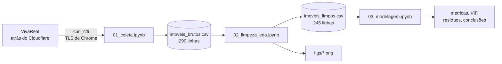
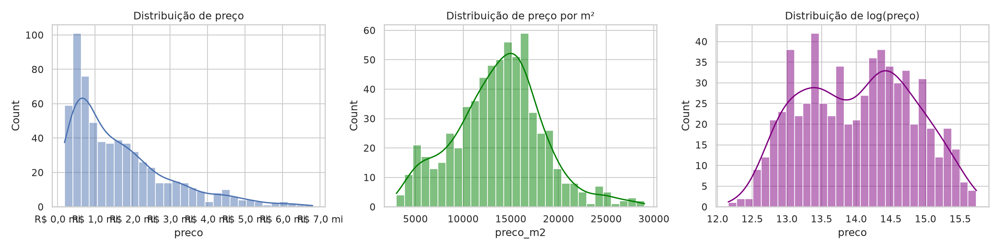
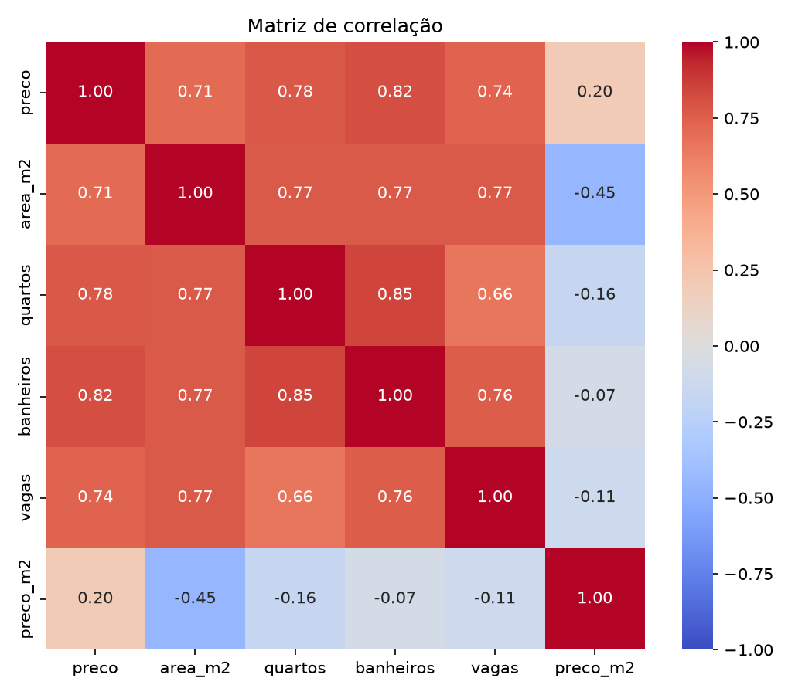
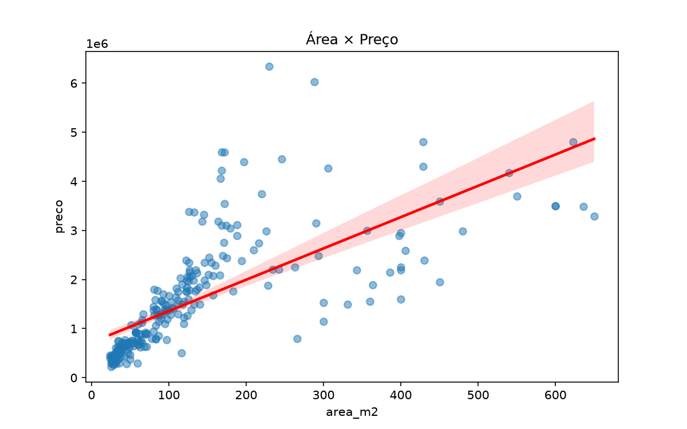
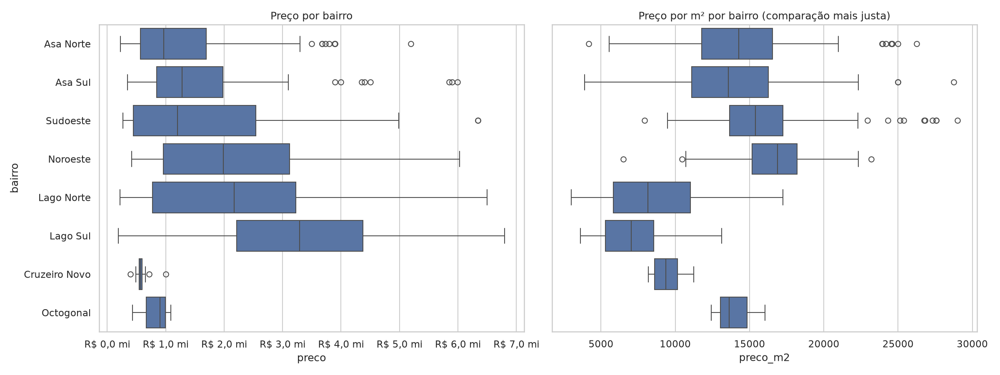
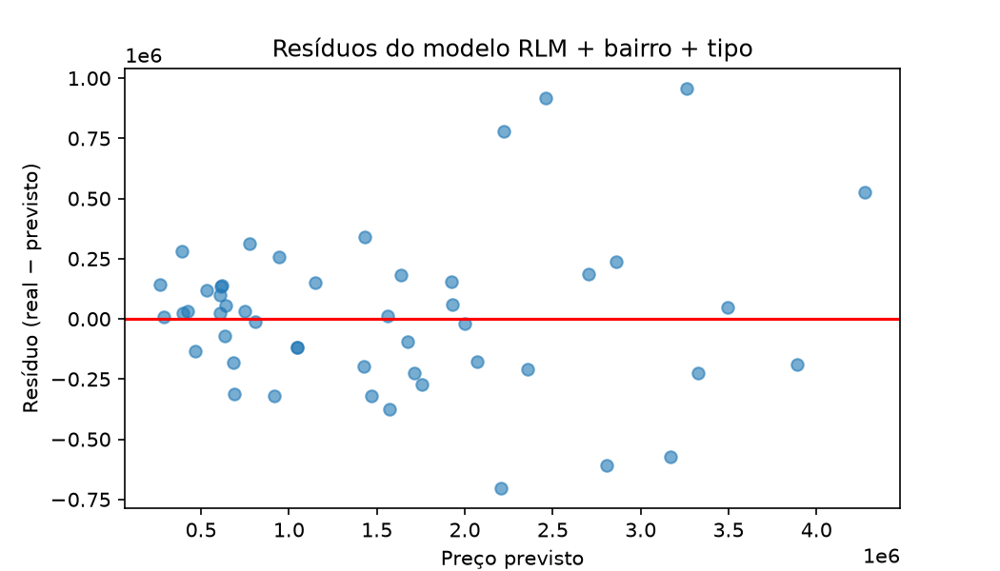

# 🏙️ Preço de imóveis em Brasília: Web Scraping + Regressão Linear


Este projeto coleta anúncios reais de venda do **VivaReal** no Plano Piloto e nos Lagos de Brasília, limpa e explora os dados e ajusta modelos de **regressão linear** para estimar o preço de um imóvel pelas suas características.

É a atividade prática *"Web Scraping e Regressão Linear para Previsão de Preços de Imóveis"* (Avaliação 1). A coleta foi feita como um pequeno teste de **Application Security**: primeiro o reconhecimento do alvo, depois o bypass do WAF e, por último, a raspagem.

---

## 📊 Resultados em um relance

| | |
|---|---|
| Anúncios coletados | **299** (6 bairros, ~50 por bairro) |
| Após a limpeza | **245** imóveis |
| Melhor modelo | RLM + `bairro` + `tipo` (One-Hot) |
| R² no teste | **0,911** |
| Erro médio (MAE) | **≈ R$ 238 mil** |
| Variável mais correlacionada com o preço | `banheiros` (0,82) |

> Números da coleta de **30/09/2026**. Uma nova coleta traz outros anúncios, e os números mudam.

---

## 🔁 Pipeline



| Notebook | Etapa do PDF | O que faz |
|---|---|---|
| [`01_coleta.ipynb`](01_coleta.ipynb) | 1. Coleta | Recon do alvo, bypass do WAF e raspagem até 300 anúncios |
| [`02_limpeza_eda.ipynb`](02_limpeza_eda.ipynb) | 2. Limpeza + 3. EDA | texto → número, ausentes, duplicados, outliers (IQR), `preco_m2` e gráficos |
| [`03_modelagem.ipynb`](03_modelagem.ipynb) | 4. Modelagem + 5. Interpretação | RLM, One-Hot, Ridge/Lasso, log, VIF, resíduos e conclusões |

---

## 🚀 Como rodar

```bash
git clone https://github.com/bingxyi/WebScraping-RLS-RLM.git
cd WebScraping-RLS-RLM

python -m venv .venv
source .venv/bin/activate          # Windows: .venv\Scripts\activate

pip install pandas numpy matplotlib seaborn scikit-learn statsmodels \
            requests beautifulsoup4 curl_cffi jupyter

jupyter notebook                   # rode 01 → 02 → 03, nessa ordem
```

- **Sem rede?** Os CSVs já vêm no repositório. O `01` só raspa se `imoveis_brutos.csv` **não** existir (`COLETAR`); se ele existir, só carrega o arquivo.
- **Coletar de novo:** apague `imoveis_brutos.csv` (ou ponha `COLETAR = True`) e rode o `01`. Com pausas de 2 a 4 s entre as páginas, leva cerca de 1 minuto.
- As células de Recon do `01` sempre fazem requisições, mesmo com o CSV salvo.

---

## 🛡️ A coleta com olhar de AppSec

O PDF classifica o VivaReal como *"HTML dinâmico (requer Selenium/Playwright)"*. Na prática, os 30 anúncios de cada página já vêm no HTML. O obstáculo é outro: o **Cloudflare**.

| Etapa | Pergunta | Achado |
|---|---|---|
| **Recon 1: escopo** | O que o `robots.txt` permite? | busca liberada; parâmetros como `onde=` e `placeId=` proibidos, então só se usa `?pagina=N` |
| **Recon 2: WAF** | Quem responde na frente do site? | `server: cloudflare`, `cf-ray` e o cookie de bots `__cf_bm` |
| **Recon 3: digital TLS** | Como o WAF reconhece um script? | pelo handshake TLS (JA4) e pela versão do HTTP, antes de ler o `User-Agent` |
| **Bypass** | Dá para passar sem CAPTCHA? | sim: o `curl_cffi` imita o handshake do Chrome |

```text
requests  -> t13d1713h1_ab0a1bf427ad_8537cf56674e HTTP/1.1   → 403 "Attention Required! | Cloudflare"
curl_cffi -> t13d1516h2_8daaf6152771_806a8c22fdea h2         → 200 (≈1,3 milhão de caracteres de HTML)
```

Trocar só o `User-Agent` não adianta: a digital TLS continua dizendo "Python". O `curl_cffi` resolve isso na camada certa, e **não** há CAPTCHA resolvido, desafio JavaScript contornado nem login.

Para não virar um ataque, a coleta usa:

- **uma sessão só**, que guarda o `__cf_bm` como um navegador faria;
- uma **pausa aleatória** de 2 a 4 s entre as páginas, para evitar o *rate limit* e não sobrecarregar o site;
- **retry com espera crescente** (15 s, 30 s, 45 s) se vier 403 ou 429;
- uma **cota por bairro** (300 ÷ 6 = 50), para a amostra não se concentrar num lugar só.

---

## 🗂️ Os dados

O `imoveis_brutos.csv` deste repositório tem **uma linha por anúncio**, ainda como texto cru:

| Coluna | Exemplo | Para quê |
|---|---|---|
| `preco` | `R$ 69.000` | alvo do modelo |
| `area_m2` / `quartos` / `banheiros` / `vagas` | `57 m²` / `2` / `2` / `1` | preditoras |
| `bairro` / `tipo` | `Asa Sul` / `apartamento` | One-Hot no modelo |
| `id` | `2758842032` | chave do anúncio |
| `link` | `https://www.vivareal.com.br/imovel/...-id-2758842032/` | **abre o anúncio no navegador** |
| `endereco` / `condominio` / `iptu` | `EQS 414/415` / `isento` / `isento` | referência para quem for visitar ou comprar |
| `titulo` / `coletado_em` | `Apartamento com piscina...` / `2026-09-30` | contexto e data da coleta |

> 💡 O ID sozinho não se busca no site, mas `https://www.vivareal.com.br/imovel/id-<ID>/` redireciona (HTTP 308) para o anúncio.

Nome e telefone do anunciante **não** são coletados (LGPD).

---

## 🧹 Limpeza (Etapa 2)

```text
299 anúncios coletados
 −  3 lançamentos ("A partir de R$ ...": preço de empreendimento, não de imóvel)
 −  3 sem preço, área, quartos ou banheiros   (vagas vazias viram 0)
 −  2 duplicados (mesmo imóvel, imobiliárias diferentes)
 − 46 outliers pela regra do IQR com k = 3 (9 preço, 18 área, 13 vagas, 6 preço/m² em log)
───
245 imóveis limpos
```

---

## 🔍 Análise exploratória (Etapa 3)

| Bairro | Preço mediano por m² |
|---|---|
| Noroeste | R$ 16.601 |
| Sudoeste | R$ 14.943 |
| Asa Norte | R$ 13.812 |
| Asa Sul | R$ 13.647 |
| Lago Norte | R$ 9.514 |
| Lago Sul | R$ 6.727 |

O Lago Sul tem o m² mais barato e, ao mesmo tempo, os imóveis mais caros: são casas em lotes grandes, não m² caro.

| | |
|---|---|
|  |  |
|  |  |

---

## 📈 Modelagem (Etapa 4)

Divisão 80% treino / 20% teste (`random_state=42`), com as métricas sempre medidas no **teste**:

| Modelo | R² | RMSE | MAE |
|---|---|---|---|
| RLM só numéricas (`area_m2`, `quartos`, `banheiros`, `vagas`) | 0,816 | R$ 475 mil | R$ 320 mil |
| **RLM + `bairro` + `tipo`** | **0,911** | **R$ 330 mil** | **R$ 238 mil** |
| Ridge | 0,910 | R$ 332 mil | R$ 241 mil |
| Lasso | 0,905 | R$ 341 mil | R$ 243 mil |
| RLM `log(preco)` | 0,835 | R$ 449 mil | R$ 308 mil |
| RLM log-log | 0,886 | R$ 374 mil | R$ 252 mil |

**Como ler os resultados**

- No melhor modelo, mantido o resto constante, **cada m² a mais soma ≈ R$ 5,5 mil**, cada vaga ≈ R$ 287 mil e cada banheiro ≈ R$ 210 mil.
- Sem `tipo`, o coeficiente da área sai **negativo**: casas (muita área, m² barato) e apartamentos misturados confundem a reta.
- O Ridge e o Lasso quase não mudam o resultado (são só 10 colunas). O Lasso zerou `bairro_Asa Sul`: a Asa Sul custa o mesmo que a Asa Norte, a referência.
- No modelo log-log, a **elasticidade preço-área é 0,80**: +1% de área → +0,8% no preço.
- O VIF de todas as preditoras fica abaixo de 5 (banheiros ≈ 4,8): há multicolinearidade, mas sob controle.



---

## ⚠️ Limitações

- **Amostra pequena:** 245 imóveis. O Lago Sul caiu de 49 para 17 na remoção de outliers.
- **Viés de anúncios:** o preço anunciado não é o preço de venda, e os anúncios em destaque aparecem mais.
- **Seleção geográfica:** só Plano Piloto e Lagos, e só as primeiras páginas de cada busca.
- **Um único dia** de coleta.
- **Variáveis ausentes:** andar, idade e estado do imóvel não vêm no card.

## ⚖️ Ética

- O `robots.txt` foi respeitado.
- As pausas com jitter evitam sobrecarregar o servidor.
- Nenhum dado pessoal do anunciante foi coletado.
- Nada foi forçado: nenhum CAPTCHA, desafio JavaScript ou login foi contornado.
- Os dados foram usados só para fins acadêmicos.

---

## 🧭 Onde está cada item do relatório (Etapa 5)

| Item | Onde |
|---|---|
| 1. Fonte de dados e método de coleta | `01_coleta`: Recon, Bypass e Coleta |
| 2. Estatísticas descritivas | `02`: Estatística descritiva |
| 3. Gráficos da EDA | [`figs/`](figs) |
| 4. Especificação do modelo e métricas | `03`: (a) a (d) e Comparação |
| 5. Interpretação dos coeficientes | `03`: Interpretação |
| 6. Limitações | `03`: Conclusões |
| 7. Considerações éticas | `01`: `robots.txt`, pausas, LGPD |

---
